# Lab 2: Agent Flow Setup

## Introduction

With the data environment in place — a Knowledge Base for RAG and Oracle AI Database tables for SQL — it's time to build the agent itself. In this lab, you'll create the AI Compute that powers the agent, design the agent flow on the visual canvas, configure the agent node with detailed instructions, and wire up all the tools: one RAG tool connected to the Knowledge Base and seven SQL tools that query box office and streaming data.

By the end of this lab, you'll have a fully configured Entertainment Release & Performance Analyst Agent ready for testing.

**Estimated Time:** 25 Minutes

### Objectives

In this lab you will:

1. Create an agent flow and attach it to the AI Compute instance
2. Configure the agent node with a model and detailed agent instructions
3. Add a RAG tool connected to the Knowledge Base you created in Lab 1
4. Add seven SQL tools that query box office and streaming data from the Oracle AI Database

### Prerequisites

This lab assumes you have:

* Completed Lab 1 (Data Environment Setup)
* A Knowledge Base (`entertainment_analyst_kb`) in Active status with documents ingested
* Access to the Oracle AI Database with entertainment performance tables
* Extracted the `agent_instructions.txt` file from the Zip archive in Lab 1

## Task 1: Create the Agent Flow

With the AI Compute instance created in Lab 1 (should be **Active** now), you can now create the agent flow — the visual canvas where you design the agent's behavior, tools, and configuration.

1. Navigate to your workspace and click on **Agent Flows**. Click the **+** button to create a new agent flow.

2. Enter a name and description:

    **Name**
    ```
    <copy>
    entertainment_analyst
    </copy>
    ```
    
    **Description**
    ```
    <copy>
    This is an internal analytics and decision-support agent for an entertainment studio or streaming platform.
    </copy>
    ```

    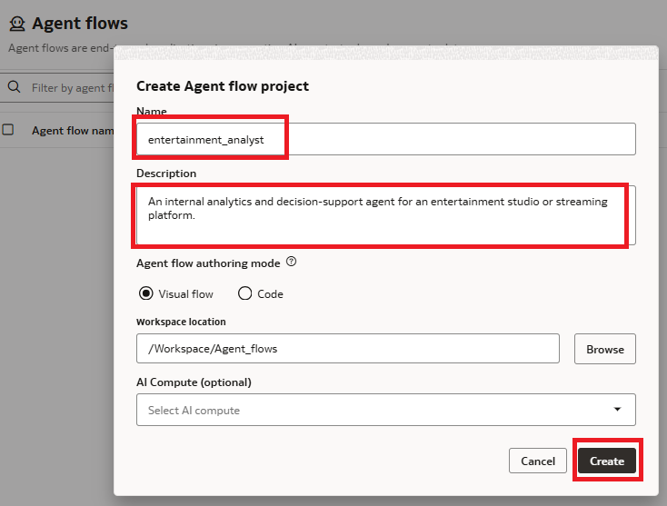

3. You will be directed to the **agent flow canvas** — a visual design environment where you'll drag and configure agent nodes and tools.

4. Attach the agent flow to the AI Compute you just created. In the upper right corner, click **Compute** → **Attach to AI Compute**, then select the AI Compute you created in Task 1.

    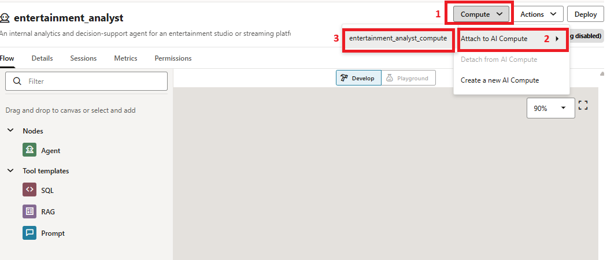

## Task 2: Configure the Agent Node

The agent node is the core of your flow. It defines the LLM model, the system instructions that govern the agent's behavior, and the reasoning approach.

1. Drag an **Agent node** onto the canvas, then click on the entity frame that appears on the Canvas.

2. Click the *Agent Name* and *Agent Description* in the drawer window to edit both. Assign more detailed values.

   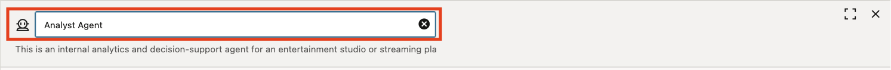

    **Name**
    ```
    <copy>
    Analyst Agent
    </copy>
    ```

   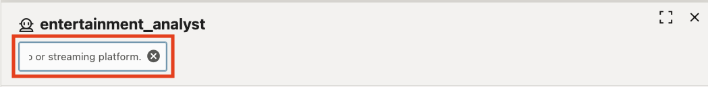
    
    **Description**
    ```
    <copy>
    This is an internal analytics and decision-support agent for an entertainment studio or streaming platform.
    </copy>
    ```

3. In the **Configuration** tab, set the following:

   **Region**

   For the **Region**, select the region corresponding to the **Generative AI Endpoint Region** in the **View Login Info**: 

   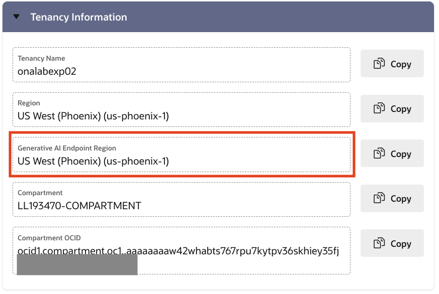

   **Model** 

   Select ```xai.grok-4-fast-reasoning```


4. For the **Agent Instructions** field, you'll need the detailed instructions that define the agent's behavior, reasoning flow, and response style. These instructions tell the agent:

    - Its role (internal analytics and decision-support for entertainment teams)
    - When to use RAG vs. SQL tools
    - The reasoning sequence: classify the question → retrieve knowledge → query data → synthesize → respond
    - Response style guidelines (concise, analytical, structured)
    - What it must NOT do (no guessing metrics, no bypassing SQL tools, no fabricating data)

5. Open the **`agent_instructions.txt`** file that was in the Zip archive you extracted earlier.

6. Delete the instructions in the **Agent Instructions** box and copy the entire content of **`agent_instructions.txt`** into the **Agent Instructions** box in the Configuration tab.

    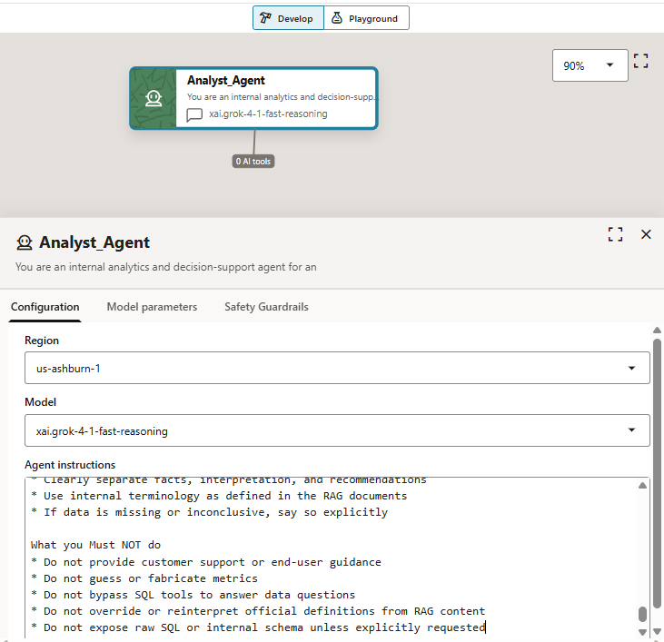

7. Leave the **Model Parameters** and **Safety Guardrails** settings as-is for now.

8. The **Agent flows** canvas auto-saves your input as you work. Now you're ready to move to the next task.

## Task 3: Add the RAG Tool

The RAG tool connects the agent to the Knowledge Base you created in Lab 1. When users ask about definitions, policies, thresholds, or interpretation rules, the agent uses this tool to retrieve relevant passages from the internal documents.

1. Drag a **RAG tool** onto the canvas.

    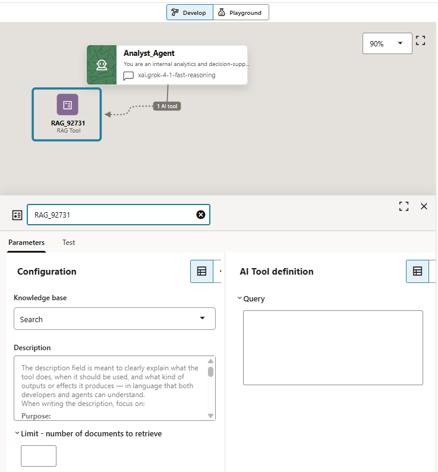

2. Enter a name:

    **Name**
    ```
    <copy>
    internal_knowledge_sources_rag
    </copy>
    ```
    
3. In the **Configuration** tab, select the Knowledge Base you created in Lab 1 (`entertainment_analyst_kb`).

    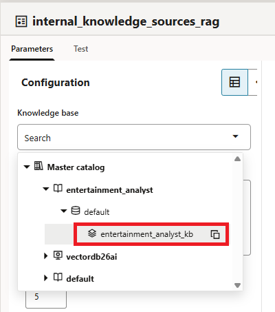

4. Enter a description. The **`Description`** field comes pre-populated with instructions on how to use the field. You'll want to delete all contents before pasting the above description.

    **Description**
    ```
    <copy>
    You have access to the following authoritative internal documents via a RAG tool: 
        - Content Strategy & Release Operations Playbook
        - Marketing Measurement & Attribution Guidelines
        - Distribution Window & Territory Rules
    </copy>
    ```

5. Set the document retrieval limit to **5**. This is the number of chunks returned by the Knowledge Base for each query.

6. Leave the **Query** field intact.

7. Optionally, click the **Test** tab to verify the RAG tool is working. Enter the following test query and click **[Submit]**:

    ```
    <copy>
    Territory priorities for releases
    </copy>
    ```

8. You should see relevant passages returned from the release playbook documents. This confirms the Knowledge Base is properly connected and returning results.

    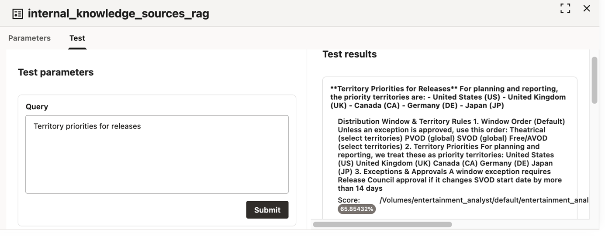

## Task 4: Add the SQL Tools — Box Office and Streaming

Now we'll add the SQL tools. Each SQL tool executes a single, pre-defined, parameterized query against the Oracle AI Database. The agent selects which tool to call based on the user's question and populates the parameters automatically.

### Tool 1: Get box office weekend data

This tool returns weekend theatrical performance for a title in a given market.

1. Drag a **SQL tool** onto the canvas.

2. Enter the name

    **Name**
    ```
    <copy>
    get_box_office_weekend
    </copy>
    ```
    
3. Under **Catalog and Schema**, click the **Search** drop-down. Expand the **`aidatabase`** item and select the **`entertainment`** schema.

    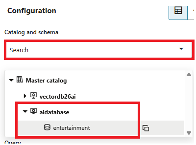

4. Enter a description. The **`Description`** field comes pre-populated with instructions on how to use the field. You'll want to delete all contents before pasting the above description.

    **Description**
    ```
    <copy>
    Weekend theatrical performance for a title in a market.
    </copy>
    ```
    
5. Enter the following SQL query:

    ```sql
    <copy>
    SELECT
      t.title_name,
      b.weekend_end_date,
      b.market_code,
      b.gross_usd_m,
      b.screens,
      b.rank
    FROM box_office_weekend b
    JOIN titles t ON t.title_id = b.title_id
    WHERE b.title_id = {{title_id}}
      AND b.market_code = {{market_code}}
    </copy>
    ```

6. The parameters `{{title_id}}` and `{{market_code}}` will appear in the right panel under **AI Tool Definition**. Enter descriptions for each:

    
    **{{title_id}}**
    ```
    <copy>
    The title ID of the movie. For example, T1002. If you are unsure, use the tool get_title_id. The last option is to ask the user.
    </copy>
    ```

    **{{market_code}}**
    ```
    <copy>
    Market code is a two letter code representing the country or region where the movie is released. These are documented in our internal policy documents. An example is Japan being JP.
    </copy>
    ```

    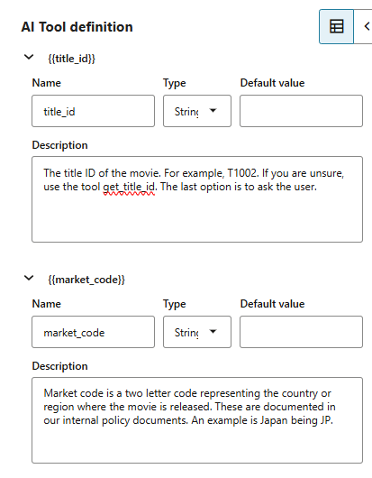

7. Optionally, click the **Test** tab and assign values to validate:

    **title_id**
    ```
    <copy>T1001</copy>
    ```

    **market_code**
    ```
    <copy>US</copy>
    ```

    You should see two rows for Skyline Heist on 2025-09-14 and 2025-09-21.

    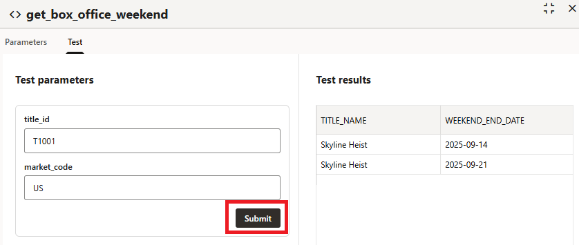

### Tool 2: Get streaming trend data

This tool returns weekly streaming health metrics (starts, hours, completion rate) for a title in a region.

1. Drag another **SQL tool** onto the canvas.

2. Enter the name. 

    **Name**
    ```
    <copy>
    get_streaming_trend
    </copy>
    ```

3. Under **Catalog and Schema**, click the **Search** drop-down. Expand the **`aidatabase`** item and select the **`entertainment`** schema.

    

4. Enter the description. The **`Description`** field comes pre-populated with instructions on how to use the field. You'll want to delete all contents before pasting the above description.

    **Description**
    ```
    <copy>
    Weekly streaming health trend (starts, hours, completion) for a title in a region.
    </copy>
    ```
    
5. Enter the following SQL query:

    ```sql
    <copy>
    SELECT
      t.title_name,
      s.week_start_date,
      s.region_code,
      s.starts,
      s.hours_streamed_k,
      s.completion_rate
    FROM streaming_weekly s
    JOIN titles t ON t.title_id = s.title_id
    WHERE s.title_id = {{title_id}}
      AND s.region_code = {{region_code}}
    ORDER BY s.week_start_date ASC
    </copy>
    ```

6. Enter parameter descriptions:

    **{{title_id}}**
    ```
    <copy>
    The title ID of the movie. For example, T1002. If you are unsure, use the tool get_title_id. The last option is to ask the user.
    </copy>
    ```

    **{{region_code}}**
    ```
    <copy>
    A two letter code representing the country or region where the movie is released. These are documented in our internal policy documents. An example is Japan being JP.
    </copy>
    ```

## Task 5: Add the SQL Tools — Reference Lookups

These tools provide reference data that helps the agent resolve IDs and codes when users ask questions using title names, market names, or campaign names instead of IDs.

### Tool 3: Get title id

1. Drag a **SQL tool** onto the canvas.

2. Enter the name: 

    **Name**
    ```
    <copy>
    get_title_id
    </copy>
    ```

3. Under **Catalog and Schema**, click the **Search** drop-down. Expand the **`aidatabase`** item and select the **`entertainment`** schema.

    

4. Enter the description. The **`Description`** field comes pre-populated with instructions on how to use the field. You'll want to delete all contents before pasting the above description.

    **Description**
    ```
    <copy>
    This tool returns a table of all title IDs and title names.
    </copy>
    ```
    
5. Enter the following SQL query:

    ```sql
    <copy>
    SELECT * FROM titles
    </copy>
    ```

6. This tool has **no parameters**.

### Tool 4: Get market code

1. Drag a **SQL tool** onto the canvas.

2. Enter the name:

    **Name**
    ```
    <copy>
    get_market_code
    </copy>
    ```
    
3. Under **Catalog and Schema**, click the **Search** drop-down. Expand the **`aidatabase`** item and select the **`entertainment`** schema.

    

4. Enter the description. The **`Description`** field comes pre-populated with instructions on how to use the field. You'll want to delete all contents before pasting the above description.

    **Description**
    ```
    <copy>
    Returns a table of market codes alongside market names and currency.
    </copy>
    ```
    
5. Enter the following SQL query:

    ```sql
    <copy>
    SELECT * FROM markets
    </copy>
    ```

6. This tool has **no parameters**.


## Lab 2 Recap

In this lab, you built the complete agent flow for the Entertainment Release & Performance Analyst:

- You created the **agent flow** on the visual canvas and attached it to the AI Compute.
- You configured the **agent node** with the xai.grok-4-fast-reasoning model and detailed instructions that define the agent's reasoning flow, response style, and behavioral guardrails.
- You added a **RAG tool** connected to the Knowledge Base containing release playbooks and strategy documents.
- You added **four SQL tools** covering box office performance, streaming health, and reference lookups for titles and markets.

The agent now has everything it needs: a brain (the LLM), internal knowledge (RAG), and structured data access (SQL). In the next lab, you'll test it in the Playground.

## Learn More

* [Oracle AI Data Platform — Sample Agent Flows on GitHub](https://github.com/oracle-samples/oracle-aidp-samples/tree/main/ai/agent-flows)
* [Build Your Agentic Solution Using Oracle Autonomous AI Database Select AI Agent — Oracle Blog](https://blogs.oracle.com/machinelearning/build-your-agentic-solution-using-oracle-adb-select-ai-agent)
* [Oracle AI Data Platform — Documentation](https://docs.oracle.com/en/cloud/paas/ai-data-platform/)

## Acknowledgements

* **Author(s)** - Jean-Rene Gauthier [AIDP]
* **Contributors** - Eli Schilling - Cloud Architect, Gareth Nathan - SDE, GenAI
* **Last Updated By/Date** - Published March 2026
