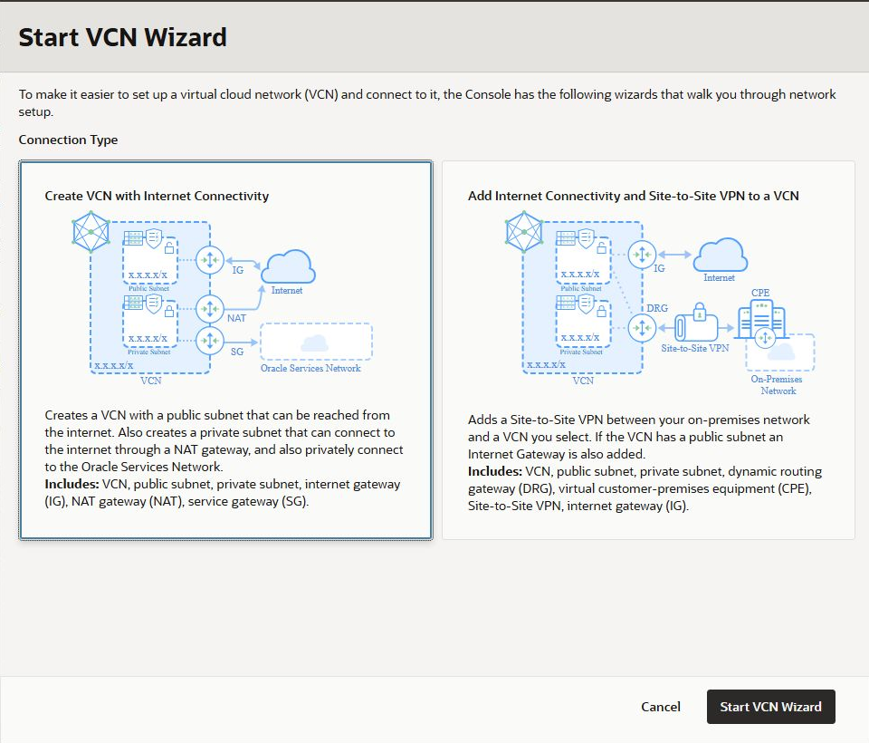

# Lab 1: Networking Recap

## Introduction

Create the Region A foundation and confirm the difference between route selection and packet permission. Route tables decide the next hop; security lists and NSGs permit traffic. You will use an NSG for the application policy and leave the default security list minimal.

**Time:** 45 minutes

## Task 1: Plan the address space and create the Region A VCNs

In your worksheet, reserve these non-overlapping CIDRs. Do not overlap them with your on-premises or corporate network if you expect to extend the design later.

| Network | Region | CIDR | Purpose |
| --- | --- | --- | --- |
| Client VCN | A | `10.10.0.0/16` | Client test instance |
| Hub VCN | A | `10.20.0.0/16` | Hub test instance and load balancer |
| Remote VCN | B | `10.30.0.0/16` | Remote test instance |

For each Region A VCN, use the **Start VCN Wizard** rather than creating the foundation components individually:

1. Open **Networking**, then **Virtual cloud networks**. Confirm that the compartment is `enschill`.
2. Select **Actions**, then **Start VCN Wizard**. Select **Create VCN with Internet Connectivity**, then select **Start VCN Wizard** again.

   

3. Create the Client VCN with these values:

   | Field | Value |
   | --- | --- |
   | VCN name | `advnet-<initials>-client-vcn` |
   | VCN CIDR block | `10.10.0.0/16` |
   | Public subnet CIDR block | `10.10.0.0/24` |
   | Private subnet CIDR block | `10.10.10.0/24` |

4. Review the generated resources and select **Create**. After provisioning completes, select **View VCN**.
5. Repeat the wizard for the Hub VCN with `advnet-<initials>-hub-vcn`, VCN CIDR `10.20.0.0/16`, public subnet CIDR `10.20.0.0/24`, and private app subnet CIDR `10.20.10.0/24`.
6. In the Hub VCN, create one additional **regional private subnet** named `advnet-<initials>-hub-lb-subnet` with CIDR `10.20.20.0/24`. Do not assign public IPv4 addresses. Associate it with the wizard-created private route table initially.

> The wizard creates regional public and private subnets, an Internet Gateway, NAT Gateway, Service Gateway, route tables, and baseline security-list rules. The public management subnet is available if you use it, but all workshop workloads and the load balancer use private subnets.
>
> The wizard also adds a free-form `VCN` tag. It is not the workshop tag. If you use a workshop tag for cleanup, add it separately to every resource you create.

## Task 2: Create gateways and route tables

Inspect the wizard-generated resources before changing them. Each private subnet has a route table with a `0.0.0.0/0 → NAT Gateway` route and a service-gateway route. This provides the outbound package access required by the metadata-app cloud-init script while keeping inbound internet access blocked.

For the Client and Hub private app subnets, create dedicated route tables named `client-private-rt` and `hub-private-rt`. Copy the NAT and Service Gateway route rules from the wizard-created private route table, then associate the dedicated route table with the corresponding app subnet. Associate the Hub load-balancer subnet with `hub-private-rt` for now. You will add DRG route rules to these dedicated tables in later labs.

At this stage, do **not** add a route between the two VCNs. That is the experiment for Lab 2.

## Task 3: Define security controls

Create `advnet-<initials>-app-nsg` in each VCN and add only the rules below. Attach the NSG to each instance in the next labs.

| Direction | Protocol/port | Source/destination | Purpose |
| --- | --- | --- | --- |
| Ingress | TCP 8080 | `10.10.0.0/16`, `10.20.0.0/16`, `10.30.0.0/16` | Metadata app |
| Ingress | TCP 22 | Your management CIDR or Bastion NSG | Administration |
| Egress | All | `0.0.0.0/0` | Updates and return traffic |

For the future load balancer, create `advnet-<initials>-lb-nsg`: permit TCP 80 from the Client VCN and the Remote VCN, and permit TCP 8080 egress to the three application CIDRs. Add an additional app-NSG ingress rule permitting TCP 8080 **from the LB NSG**. Referencing the NSG, rather than an IP range, keeps the backend policy tied to the load balancer identity.

## Task 4: Verify the foundation

Use the VCN route-table and security-rule views to verify:

1. Private subnets have a NAT default route only when outbound access is needed.
2. No route currently exists between Client and Hub CIDRs.
3. App NSGs permit port 8080 only from workshop CIDRs and the load-balancer NSG.

> **Expected result:** the VCN Wizard’s review page shows the VCN, public subnet, private subnet, Internet Gateway, NAT Gateway, and Service Gateway it will create. The final VCN details page shows these resources as available.

**Checkpoint:** Save the VCN, subnet, route-table, NSG, and gateway OCIDs. Do not proceed until Region A has two non-overlapping VCNs and the security policy exists.
