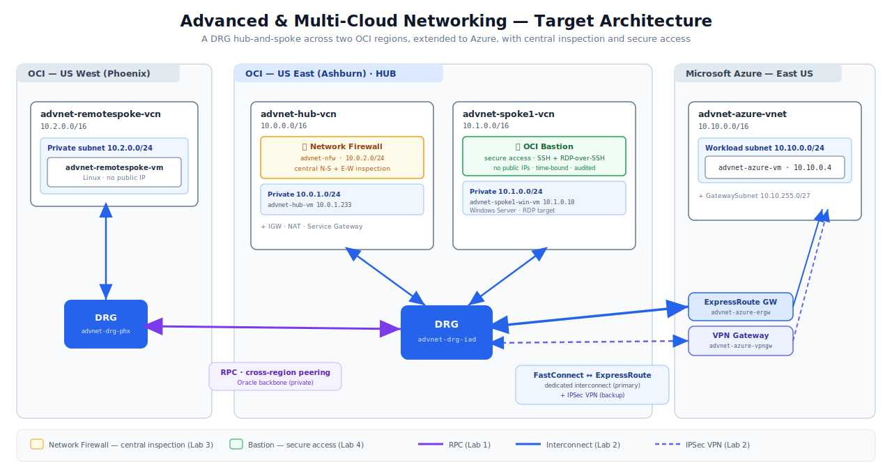

# Introduction

## About this Workshop

This workshop walks you through building a production-shaped, multi-cloud network — from an empty tenancy to a fully connected, centrally inspected, and securely accessible topology spanning two OCI regions and Microsoft Azure — and then tearing it back down cleanly.

It is deliberately **sequential**: each lab leaves behind infrastructure the next lab builds on, so by the end you have assembled one coherent architecture rather than a handful of disconnected demos. You begin with a Dynamic Routing Gateway (DRG) hub-and-spoke in Ashburn, extend it across regions to Phoenix with a Remote Peering Connection, reach out to an application VNet in Azure over a dedicated interconnect (and a working IPSec VPN), drop a single next-generation firewall into the hub to inspect everything, layer on just-in-time secure access with OCI Bastion, and finish by validating and troubleshooting the whole thing with OCI's native network observability tools.

**The target end state you will build:**

* **OCI Region A — Ashburn:** a DRG-based hub-and-spoke (a Hub VCN plus a Spoke VCN), locally connected through a v2 Dynamic Routing Gateway.
* **OCI Region B — Phoenix:** a Remote-Spoke VCN, joined to Region A through a Remote Peering Connection (RPC) between the two regions' DRGs.
* **Microsoft Azure — East US:** an application VNet, joined to the OCI hub through **FastConnect ⇄ ExpressRoute** (the production interconnect) with a **Site-to-Site IPSec VPN** as the working alternative/backup.
* **Centralized inspection:** a single OCI Network Firewall in the Hub VCN, inspecting both north-south and east-west traffic.
* **Secure access:** OCI Bastion providing SSH and RDP-over-SSH to private hosts that have no public IPs.
* **Observability:** Network Visualizer, Network Path Analyzer, and VCN Flow Logs for validation and troubleshooting.

**Workshop structure:**

| Lab | Focus | Est. time |
|-----|-------|-----------|
| Lab 1 | OCI hub-and-spoke — local & remote VCN peering (DRG + RPC) | 50 min |
| Lab 2 | Multi-cloud — connecting OCI to Microsoft Azure | 50 min |
| Lab 3 | Centralized inspection — OCI Network Firewall | 40 min |
| Lab 4 | Secure access — OCI Bastion | 30 min |
| Lab 5 | Troubleshooting — Network Command Center | 30 min |
| Cleanup | Remove all resources in dependency order | 30 min |

> **A note on conventions:** every resource you create carries the name prefix `advnet-` and the free-form tag `workshop = adv-networking`. This convention is what makes the final cleanup safe — nothing is deleted unless it carries this tag.

> **A note on cost:** most of this workshop uses low-cost or free components, but two items bill while they exist — the Azure **ExpressRoute circuit** (which bills as soon as it is *provisioned*, before any traffic flows) and the OCI **Network Firewall**. Provision them when the lab calls for it and remove them promptly during Cleanup.

*Estimated Workshop Time:* 4 hours (excluding resource provisioning wait times)

### Objectives

In this workshop, you will:

* Build a **DRG v2 hub-and-spoke** across two OCI regions, with both **local** (same-region) and **remote** (cross-region, RPC) connectivity
* Extend the topology to **Microsoft Azure** over a dedicated **FastConnect ⇄ ExpressRoute** interconnect and a **Site-to-Site IPSec VPN**
* Centralize traffic inspection with a single **OCI Network Firewall** in the hub, inserted by routing
* Provide audited, time-bound **secure access** to private hosts with **OCI Bastion** (SSH and RDP-over-SSH)
* **Validate and troubleshoot** the topology with the Network Command Center — Network Visualizer, Network Path Analyzer, and VCN Flow Logs
* **Tear everything down** cleanly, in the correct dependency order

### Prerequisites

This workshop assumes you have:

* An **Oracle Cloud account** subscribed to **both** the **US East (Ashburn)** and **US West (Phoenix)** regions
* OCI entitlement to create **FastConnect** virtual circuits (for the dedicated interconnect in Lab 2)
* A **Microsoft Azure subscription** with rights to create virtual networks, virtual network gateways, and VMs — and **ExpressRoute** for the dedicated path
* Basic familiarity with core OCI networking concepts: VCN, subnet, route table, security list vs. NSG, and gateways (Internet, NAT, Service, Dynamic Routing)
* IAM permissions equivalent to: `manage virtual-network-family`, `manage drgs`, `manage remote-peering-connections`, `manage network-firewall-family`, `manage bastion-family`, `manage instance-family`, and logging permissions for VCN Flow Logs
* An SSH key pair (you generate one during Lab 1 and reuse it for Bastion)

> This is an **intermediate-to-advanced** workshop intended for cloud and network engineers and architects who already understand the basics of OCI networking.

## Learn More

* [OCI Networking documentation](https://docs.oracle.com/en-us/iaas/Content/Network/Concepts/overview.htm)
* [Dynamic Routing Gateways (DRG)](https://docs.oracle.com/en-us/iaas/Content/Network/Tasks/managingDRGs.htm)
* [Connectivity to Microsoft Azure](https://docs.oracle.com/en-us/iaas/Content/Network/Concepts/azure.htm)
* [OCI Network Firewall](https://docs.oracle.com/en-us/iaas/Content/network-firewall/overview.htm)
* [OCI Bastion](https://docs.oracle.com/en-us/iaas/Content/Bastion/Concepts/bastionoverview.htm)
* [Network Path Analyzer](https://docs.oracle.com/en-us/iaas/Content/Network/Concepts/path_analyzer.htm)

## Acknowledgements

* **Author** — Eli Schilling, Technical Engagement Services, Oracle
* **Contributors** — Oracle LiveLabs Platform Team
* **Last Updated By/Date** — Eli Schilling, June 2026