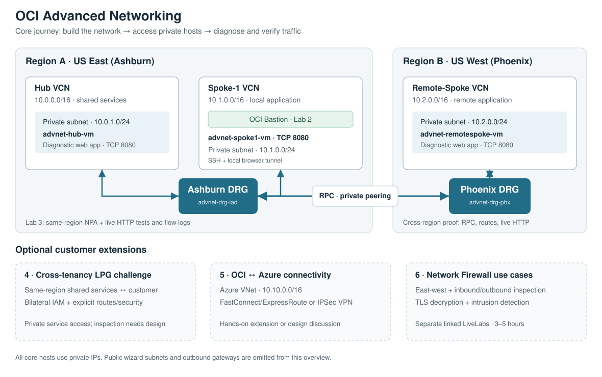

# Introduction

## About this Workshop

Build and operate a private OCI network spanning two regions. You start with a DRG hub-and-spoke in **US East (Ashburn)**, extend it to **US West (Phoenix)** with remote peering, reach private workloads through **OCI Bastion**, and diagnose routing and security with **Network Command Center**. The three core labs form one continuous attendee journey: **build → access → verify and troubleshoot**.

The customer scenario is a platform team delivering a common network foundation for application teams. A Hub VCN holds shared services, a local Spoke VCN holds an application, and a Remote-Spoke VCN represents an application in another region. Each VCN has a private Linux test host running a small diagnostic web page. The page identifies the responding host and region, making the network tests tangible.

Optional labs extend the conversation to a managed-services relationship across tenancies, OCI–Azure connectivity, and managed network inspection. Select those extensions to match your available access and event agenda.



### Workshop structure

| Lab | Focus | Estimated time | Required access |
| --- | --- | --- | --- |
| Lab 1 | OCI Hub-and-Spoke: local DRG peering and cross-region RPC | 60–75 minutes | One OCI tenancy, Ashburn and Phoenix |
| Lab 2 | Secure Access: OCI Bastion, SSH, and private web access | 35–45 minutes | Same tenancy; local SSH client |
| Lab 3 | Troubleshooting: Network Command Center and VCN Flow Logs | 40–50 minutes | Same tenancy; NPA and Logging permissions |
| Optional Lab 4 | Challenge: cross-tenancy local peering for shared services | 45–60 minutes | Two OCI tenancies in the same region |
| Optional Lab 5 | Multicloud: OCI–Azure interconnect and Site-to-Site VPN | 90–120 minutes plus provisioning | OCI and Azure; circuit/gateway permissions |
| Optional Lab 6 | OCI Network Firewall Common Use Cases: linked LiveLabs workshop | 3–5 hours | Separate workshop prerequisites |
| Cleanup | Remove the resources you created | 20–30 minutes | Resource-owner permissions |

**Plan approximately 3 hours for Labs 1–3, plus cleanup and provisioning time.** The optional RDP exercise in Lab 2 adds approximately 20–30 minutes and requires a larger host. Optional Lab 5 can also be delivered as a 25-minute design discussion without creating circuits or VPN gateways. Optional Lab 6 is a separate, extended workshop, not a short step in the core event.

### Objectives

In the core workshop, you will:

* Build three non-overlapping VCNs and distinguish subnet routing from traffic permission.
* Connect same-region VCNs with a DRG and connect regions with an RPC.
* Deploy three private diagnostic endpoints with no public IP addresses.
* Use time-bound Bastion sessions for administrative and application access.
* Use topology views, configuration analysis, and live traffic evidence together.
* Diagnose a deliberately introduced routing fault, restore the route, and document the result.
* Remove workshop infrastructure in dependency order.

The optional extensions cover bilateral cross-tenancy IAM, hybrid and multicloud transport choices, and centralized inspection through the linked firewall workshop.

### Prerequisites

* An OCI tenancy subscribed to **US East (Ashburn)** and **US West (Phoenix)**, with capacity for three small Oracle Linux instances and their boot volumes.
* An assigned working compartment. The examples use **`advnet-workshop`**; use the compartment your facilitator assigns, such as `enschill`, throughout both regions.
* Familiarity with VCNs, CIDRs, subnets, route tables, security lists, NSGs, and gateways.
* A local SSH client and an SSH key pair. Use the same public key for the three hosts and Bastion sessions; keep the private key on your workstation.
* Permission to manage networking, compute and volumes, Bastion, logging resources, and capture filters in the working compartment. Your administrator must also configure the NPA permissions in Lab 3 before the event.

An administrator can use the following **core-lab example** as a starting point. Replace the group and compartment placeholders; for a group in an identity domain, use the appropriate domain-qualified group name. An existing administrator policy may already cover these permissions.

```text
Allow group <workshop-group> to manage virtual-network-family in compartment <workshop-compartment>
Allow group <workshop-group> to manage instance-family in compartment <workshop-compartment>
Allow group <workshop-group> to manage volume-family in compartment <workshop-compartment>
Allow group <workshop-group> to manage bastion-family in compartment <workshop-compartment>
Allow group <workshop-group> to read instance-agent-plugins in compartment <workshop-compartment>
Allow group <workshop-group> to inspect work-requests in compartment <workshop-compartment>
Allow group <workshop-group> to manage log-groups in compartment <workshop-compartment>
Allow group <workshop-group> to manage log-content in compartment <workshop-compartment>
Allow group <workshop-group> to manage capture-filters in compartment <workshop-compartment>
Allow group <workshop-group> to read audit-events in compartment <workshop-compartment>
```

See [Bastion IAM guidance](https://docs.oracle.com/en-us/iaas/Content/Bastion/Tasks/managingbastions.htm) and the [Network Path Analyzer permissions](https://docs.oracle.com/en-us/iaas/Content/Network/Concepts/path_analyzer.htm). The optional labs add their own access requirements; Azure, a second tenancy, and Network Firewall are not prerequisites for the core path.

### Resource ownership, costs, and your worksheet

Use the prefix **`advnet-`** and the free-form tag **`workshop = adv-networking`** on supported resources. In a shared compartment, add **`attendee = <your-initials>`** and include your initials in resource names. The examples omit initials for readability; make the same substitution everywhere. The VCN Wizard's generated `VCN` tag does not replace these workshop tags.

Record the region, compartment, resource name, OCID, and private IP as you create each resource. Cleanup requires both this inventory and confirmation that you own the resource; a shared tag by itself is insufficient.

Compute, boot volumes, network data transfer, and logging can incur charges. Always Free eligibility depends on your tenancy, home region, quotas, and available shapes. Optional Lab 5 adds Azure gateways and circuits: [ExpressRoute billing starts when its service key is issued](https://learn.microsoft.com/en-us/azure/expressroute/expressroute-howto-circuit-portal-resource-manager). The linked Network Firewall workshop has separate billable resources. Delete resources promptly when the exercises finish.

### How to use the evidence

Screenshots show the VCN Wizard choice and the RPC **Peered** state. Resource names and CIDRs in your own worksheet are authoritative. Architecture diagrams explain the intended paths; they are not console screenshots. A configuration analysis does not establish that an application is running: use the metadata page, `curl`, and logs to close that gap.

At the end of each core lab, save its checkpoint before continuing. These records become a compact handover package: topology, secure-access method, successful traffic tests, fault diagnosis, and cleanup inventory.

## Learn More

* [OCI Networking documentation](https://docs.oracle.com/en-us/iaas/Content/Network/Concepts/overview.htm)
* [Dynamic Routing Gateways](https://docs.oracle.com/en-us/iaas/Content/Network/Tasks/managingDRGs.htm)
* [OCI Bastion](https://docs.oracle.com/en-us/iaas/Content/Bastion/Concepts/bastionoverview.htm)
* [Network Command Center: Network Path Analyzer](https://docs.oracle.com/en-us/iaas/Content/Network/Concepts/path_analyzer.htm)
* [Oracle Interconnect for Azure](https://docs.oracle.com/en-us/iaas/Content/multicloud/interconnect-azure.htm)

## Acknowledgements

* **Author** — Eli Schilling, Technical Engagement Services, Oracle
* **Contributors** — Oracle LiveLabs Platform Team
* **Last Updated By/Date** — Eli Schilling, October 2026
