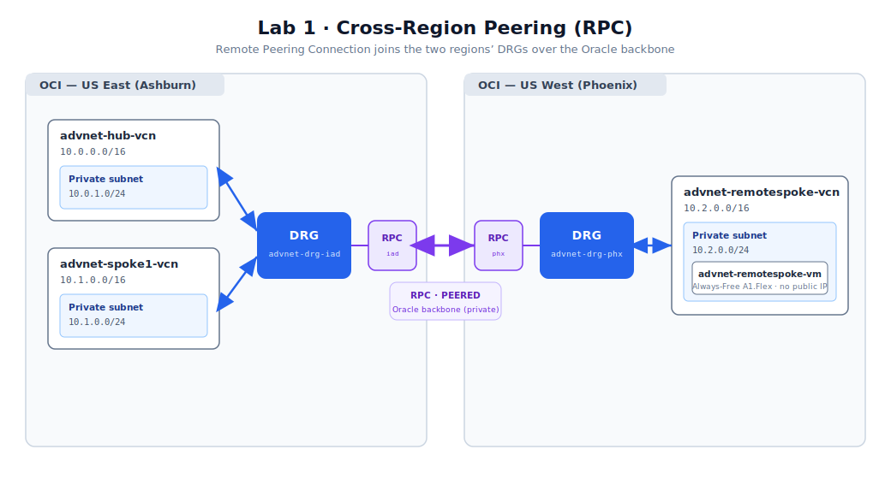
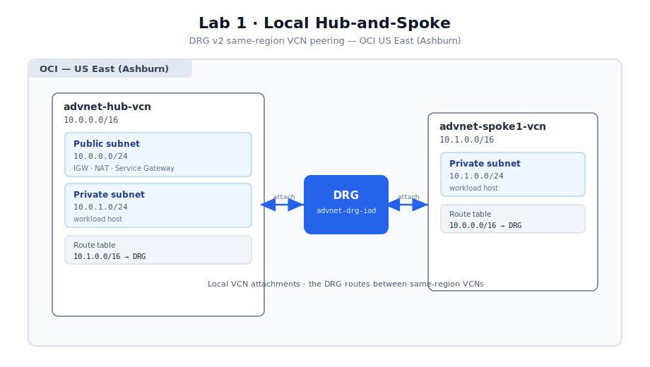

# Lab 1: OCI Hub-and-Spoke — Local and Remote VCN Peering

## Introduction

In this lab you build the foundation that every later lab extends: a three-VCN, two-region backbone connected entirely through **Dynamic Routing Gateways (DRG v2)**. You create a Hub VCN and a Spoke VCN in Ashburn, connect them *locally* through a single DRG, then stand up a Remote-Spoke VCN in Phoenix and join it *across regions* through a **Remote Peering Connection (RPC)** between the two regions' DRGs.

This DRG-based hub-and-spoke is the Oracle-recommended pattern for connecting more than two VCNs. Unlike a Local Peering Gateway (LPG), which is point-to-point and non-transitive, the DRG acts as a regional router that scales to many attachments and — crucially for Lab 3 — lets you insert a central firewall later with no re-architecture.

*Estimated Time:* 50 minutes

### About Dynamic Routing Gateways

A DRG is a virtual router that lives at the tenancy/region level. VCNs connect to it through **DRG attachments**; the DRG then routes between those attachments using **DRG route tables** and **route distributions**. Same-region VCN-to-VCN traffic flows through a single DRG. Cross-region traffic flows over an **RPC**, a private Oracle-backbone link between two DRGs in different regions — no public internet, no VPN.



### Objectives

In this lab, you will:

* Create three VCNs across two regions with non-overlapping CIDRs
* Create a DRG in each region and attach the local VCNs
* Establish **local** connectivity (Hub ⇄ Spoke-1) through the Ashburn DRG
* Establish **remote** connectivity (Ashburn ⇄ Phoenix) through an RPC
* Configure route tables and security lists for end-to-end reachability
* Launch a test VM that later labs will inspect, secure, and troubleshoot

### Prerequisites

This lab assumes you have:

* An Oracle Cloud account subscribed to **both** the **US East (Ashburn)** and **US West (Phoenix)** regions
* Permissions equivalent to `manage virtual-network-family`, `manage drgs`, `manage remote-peering-connections`, and `manage instance-family` in your working compartment
* A dedicated compartment for the workshop (this lab uses one named **`advnet-workshop`**)

> **Naming & tagging convention:** every resource you create carries the prefix `advnet-` and the free-form tag `workshop = adv-networking`. This is what makes the Lab 6 cleanup safe — nothing is deleted unless it carries this tag.

> **CIDR plan (non-overlapping by design):**
>
> | Network | Region | CIDR | Private subnet |
> |---------|--------|------|----------------|
> | Hub VCN | Ashburn | `10.0.0.0/16` | `10.0.1.0/24` (public `10.0.0.0/24`) |
> | Spoke-1 VCN | Ashburn | `10.1.0.0/16` | `10.1.0.0/24` |
> | Remote-Spoke VCN | Phoenix | `10.2.0.0/16` | `10.2.0.0/24` |
>
> The supernet `10.0.0.0/14` covers all three OCI VCNs and is used as a convenient source range in security rules.

## Task 1: Create the Hub VCN in Ashburn

The Hub VCN is the center of the topology. It will eventually host the NAT gateway, the internet gateway, and (in Lab 3) the Network Firewall.

1. Confirm the region selector at the top right reads **US East (Ashburn)**.

2. Open the navigation menu and choose **Networking → Virtual Cloud Networks**. Select your **`advnet-workshop`** compartment in the list scope on the left.

   

3. Click **Start VCN Wizard**, choose **Create VCN with Internet Connectivity**, and click **Start VCN Wizard**.

4. Complete the wizard:

   * **VCN Name:** `advnet-hub-vcn`
   * **Compartment:** `advnet-workshop`
   * **VCN CIDR Block:** `10.0.0.0/16`
   * **Public Subnet CIDR Block:** `10.0.0.0/24`
   * **Private Subnet CIDR Block:** `10.0.1.0/24`

   

5. Click **Next**, review, then click **Create**. The wizard provisions the VCN, both subnets, an internet gateway, a NAT gateway, a service gateway, and default route tables and security lists.

6. When the wizard finishes, click **View VCN**. Confirm you see the public and private subnets and all three gateways.

   

## Task 2: Create the Spoke-1 VCN in Ashburn

Spoke-1 holds a private workload and (in Lab 4) the Bastion. It needs only a private subnet.

1. Still in **Ashburn**, go to **Networking → Virtual Cloud Networks** and click **Create VCN** (the simple, non-wizard option).

2. Configure:

   * **Name:** `advnet-spoke1-vcn`
   * **Compartment:** `advnet-workshop`
   * **IPv4 CIDR Block:** `10.1.0.0/16`

   Click **Create VCN**.

3. Open `advnet-spoke1-vcn`, choose **Subnets → Create Subnet**:

   * **Name:** `advnet-spoke1-private`
   * **CIDR Block:** `10.1.0.0/24`
   * **Subnet Access:** **Private Subnet**
   * Leave the default route table and security list for now (you adjust them in Task 5).

   

4. *(Optional but recommended)* Add a **Service Gateway** to this VCN so the private host can reach Oracle Services (YUM, Object Storage) without internet egress. **Networking → Service Gateway → Create Service Gateway**, select **All <region> Services in Oracle Services Network**.

## Task 3: Create the Remote-Spoke VCN in Phoenix

This VCN lives in a *different region*, which is what makes the remote-peering step real.

1. Switch the region selector to **US West (Phoenix)**.

2. Create the VCN exactly as in Task 2:

   * **Name:** `advnet-remotespoke-vcn`
   * **IPv4 CIDR Block:** `10.2.0.0/16`

3. Add a private subnet:

   * **Name:** `advnet-remotespoke-private`
   * **CIDR Block:** `10.2.0.0/24`
   * **Subnet Access:** **Private Subnet**

   

## Task 4: Create the Ashburn DRG and attach the local VCNs

1. Switch back to **US East (Ashburn)**.

2. Go to **Networking → Dynamic Routing Gateways → Create Dynamic Routing Gateway**:

   * **Name:** `advnet-drg-iad`
   * **Compartment:** `advnet-workshop`

   Click **Create Dynamic Routing Gateway** and wait for the state to become **Available**.

   

3. Open `advnet-drg-iad`. Under **Resources**, choose **Virtual Cloud Network Attachments → Create Virtual Cloud Network Attachment**:

   * **Name:** `advnet-hub-attach`
   * **Virtual Cloud Network:** `advnet-hub-vcn`

   Click **Create**. Repeat to attach the spoke:

   * **Name:** `advnet-spoke1-attach`
   * **Virtual Cloud Network:** `advnet-spoke1-vcn`

   

   > Each VCN attachment automatically gets an entry in the DRG's autogenerated route distribution, so the DRG already knows how to reach both VCNs' CIDRs. The piece you still owe is telling each **VCN** to send cross-VCN traffic *to the DRG* — that's Task 5.

## Task 5: Configure local routing and security (Hub ⇄ Spoke-1)

A DRG attachment alone does not move traffic — each subnet's route table must point the *other* VCN's CIDR at the DRG, and the security lists must permit it.



1. **Hub private subnet route table.** Open `advnet-hub-vcn → Route Tables → the private subnet's route table`. Click **Add Route Rules** and add:

   | Target Type | Destination CIDR | Target |
   |-------------|------------------|--------|
   | Dynamic Routing Gateway | `10.1.0.0/16` | `advnet-drg-iad` |
   | Dynamic Routing Gateway | `10.2.0.0/16` | `advnet-drg-iad` |

   (The `10.2.0.0/16` rule prepares for the remote spoke in Task 7. The NAT and Service Gateway rules created by the wizard remain in place.)

   

2. **Spoke-1 route table.** Open the Spoke-1 private subnet's route table and add:

   | Target Type | Destination CIDR | Target |
   |-------------|------------------|--------|
   | Dynamic Routing Gateway | `10.0.0.0/16` | `advnet-drg-iad` |
   | Dynamic Routing Gateway | `10.2.0.0/16` | `advnet-drg-iad` |

3. **Security lists.** On both the Hub private and Spoke-1 security lists, add a stateful **ingress** rule permitting the workshop supernet so the test VMs can reach each other:

   * **Source Type:** CIDR
   * **Source CIDR:** `10.0.0.0/14`
   * **IP Protocol:** All Protocols

   

   > **Security note:** an "all protocols from `10.0.0.0/14`" rule is a *lab simplification*. In production you would scope ingress to specific ports (for example, ICMP for reachability tests and TCP 22 for SSH) and tighter source ranges.

## Task 6: Create the Phoenix DRG and attach the Remote-Spoke

1. Switch to **US West (Phoenix)**.

2. Create the DRG:

   * **Name:** `advnet-drg-phx`

3. Attach the remote spoke VCN:

   * **Name:** `advnet-remotespoke-attach`
   * **Virtual Cloud Network:** `advnet-remotespoke-vcn`

   

4. Add a route rule to the Remote-Spoke private route table pointing the Ashburn CIDRs at the Phoenix DRG:

   | Target Type | Destination CIDR | Target |
   |-------------|------------------|--------|
   | Dynamic Routing Gateway | `10.0.0.0/16` | `advnet-drg-phx` |
   | Dynamic Routing Gateway | `10.1.0.0/16` | `advnet-drg-phx` |

5. Add the same `10.0.0.0/14` all-protocols ingress rule to the Remote-Spoke security list.

## Task 7: Establish remote peering (Ashburn ⇄ Phoenix RPC)

An RPC is created on **each** DRG; one side then initiates the peering handshake using the other side's RPC OCID and region.

1. In **Phoenix**, open `advnet-drg-phx → Remote Peering Connections → Create Remote Peering Connection`:

   * **Name:** `advnet-rpc-phx`

   Copy its **OCID** once it becomes **Available**.

   

2. Switch to **Ashburn**, open `advnet-drg-iad → Remote Peering Connections → Create Remote Peering Connection`:

   * **Name:** `advnet-rpc-iad`

3. Open `advnet-rpc-iad` and click **Establish Connection**:

   * **Region:** US West (Phoenix)
   * **Remote Peering Connection OCID:** paste the OCID of `advnet-rpc-phx`

   Click **Establish Connection**. Within a minute both RPCs move to the **Peered** state.

   

   > **Verify in CLI (optional).** From Cloud Shell:
   > ```
   > oci network remote-peering-connection get \
   >   --remote-peering-connection-id <advnet-rpc-iad-OCID> \
   >   --query 'data."peering-status"' --raw-output
   > ```
   > Returns `PEERED`.

4. Confirm the cross-region route rules from Tasks 5 and 6 are in place (`10.2.0.0/16` reachable from Ashburn VCNs; `10.0.0.0/16` and `10.1.0.0/16` reachable from Phoenix). The DRGs exchange these CIDRs automatically across the RPC through their autogenerated route distributions.

## Task 8: Launch a test VM

You launch one VM now; later labs use it as a live endpoint. The steps below create the **Remote-Spoke** VM in Phoenix. **Repeat the same steps to create a Hub VM and a Spoke-1 VM in Ashburn** (changing only the region, VCN, subnet, and name) so every VCN has a reachable host.

1. In **Phoenix**, go to **Compute → Instances → Create Instance**.

2. Configure:

   * **Name:** `advnet-remotespoke-vm`
   * **Compartment:** `advnet-workshop`
   * **Image:** Oracle Linux 9
   * **Shape:** `VM.Standard.A1.Flex` — **1 OCPU / 6 GB** (Always Free eligible)
   * **Primary VNIC → Virtual Cloud Network:** `advnet-remotespoke-vcn`
   * **Subnet:** `advnet-remotespoke-private`
   * **Do not assign a public IPv4 address** (these hosts are reached through the DRG and, later, the Bastion)

   

3. Under **Add SSH keys**, either generate a new key pair and **download the private key**, or paste your own public key. You reuse this key for Bastion access in Lab 4.

4. Click **Create**. When the instance reaches **Running**, note its **private IP** (for example `10.2.0.x`).

   > Because the host has no public IP, you cannot SSH to it directly yet — that is exactly the problem **Lab 4 (Bastion)** solves. For now, reachability across the backbone is validated in **Lab 5** with Network Path Analyzer.

## Lab Recap

You built a production-shaped backbone:

* Three VCNs across two regions with non-overlapping CIDRs
* A DRG in each region, with the local VCNs attached
* **Local** Hub ⇄ Spoke-1 connectivity through the Ashburn DRG
* **Remote** Ashburn ⇄ Phoenix connectivity through a **Peered** RPC
* Route tables and security lists for end-to-end reachability
* A test VM (with the pattern to add the other two)

This DRG hub-and-spoke is the platform the rest of the workshop builds on: Lab 2 extends it to Azure, Lab 3 inserts a firewall in the hub, Lab 4 adds secure access, and Lab 5 troubleshoots it.

## Learn More

* [Dynamic Routing Gateway (DRG) overview](https://docs.oracle.com/en-us/iaas/Content/Network/Tasks/managingDRGs.htm)
* [Remote VCN Peering using an RPC](https://docs.oracle.com/en-us/iaas/Content/Network/Tasks/remoteVCNpeering.htm)
* [Transit routing and DRG route tables](https://docs.oracle.com/en-us/iaas/Content/Network/Tasks/transitrouting.htm)
* [Access to Oracle Services: Service Gateway](https://docs.oracle.com/en-us/iaas/Content/Network/Tasks/servicegateway.htm)

## Acknowledgements

* **Author** — Eli Schilling, Technical Engagement Services, Oracle
* **Contributors** — Oracle LiveLabs Platform Team
* **Last Updated By/Date** — Eli Schilling, June 2026
