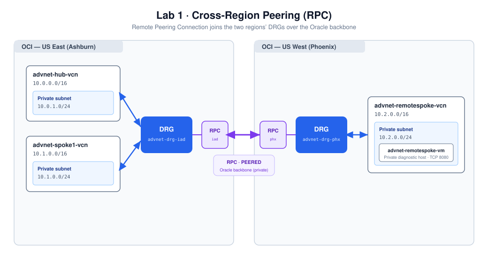
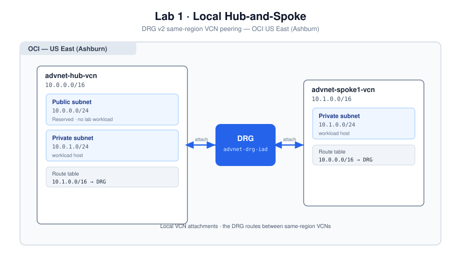
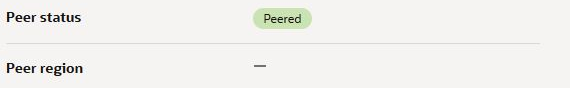

# Lab 1: OCI Hub-and-Spoke — Local and Remote VCN Peering

## Introduction

Build the foundation for the customer scenario: a three-VCN, two-region network connected through **Dynamic Routing Gateways (DRGs)**. A Hub VCN and Spoke-1 VCN in **Ashburn** attach to one DRG. A Remote-Spoke VCN in **Phoenix** attaches to a second DRG. A **Remote Peering Connection (RPC)** joins the regional routers over Oracle's private backbone.

The hub is a place to host shared services; the DRG is the router. In this lab the DRG routes directly between its attachments. Traffic does **not** automatically pass through a host or firewall in the Hub VCN. Centralized inspection would require a separate routing and security design, explored in Optional Lab 6.

**Estimated time:** 60–75 minutes, plus compute provisioning and package installation.

### About Dynamic Routing Gateways

A DRG routes traffic between attached networks. A **VCN subnet route table** sends off-VCN traffic to the DRG. A **DRG route table**, associated with the attachment on which traffic enters the DRG, selects the outgoing attachment. Import route distributions populate DRG route tables with learned routes. These are separate routing decisions; security lists and NSGs then determine whether the traffic is permitted.



### Objectives

* Plan three non-overlapping VCNs and use the VCN Wizard to create their foundations.
* Create one DRG per region and attach each VCN.
* Configure reciprocal subnet routes and application security controls.
* Establish local DRG connectivity and remote RPC peering.
* Deploy three private Oracle Linux hosts with a diagnostic application on TCP 8080.
* Record the topology and prepare the endpoints for Bastion access and troubleshooting.

### Prerequisites

* The Introduction's tenancy, regional subscriptions, IAM, compute capacity, and SSH-key prerequisites.
* A working compartment, shown as **`advnet-workshop`** in the examples. Substitute your assigned compartment consistently.
* A workstation on which you can save the application bootstrap file and your SSH private key.

> **Naming and ownership:** use `advnet-` names and `workshop = adv-networking` tags. In a shared compartment, include your initials in names and add your attendee tag. Tag supported wizard-created resources after creation, and keep an inventory. The wizard's `VCN` tag is not the workshop tag.

## Task 1: Plan the address space

Reserve these **non-overlapping** networks in your worksheet. Check for overlap with existing VCNs, on-premises networks, and any Azure VNet you intend to connect. Use the same CIDRs consistently in subnet routes, DRG route checks, and security rules.

| Network | Region | CIDR | Purpose |
| --- | --- | --- | --- |
| Hub VCN | A — US East (Ashburn) | `10.0.0.0/16` | Shared services and Hub test instance |
| Spoke-1 VCN | A — US East (Ashburn) | `10.1.0.0/16` | Local application and Bastion test instance |
| Remote-Spoke VCN | B — US West (Phoenix) | `10.2.0.0/16` | Remote application and cross-region test instance |

1. Record the working compartment and your name prefix.
2. Reserve the subnet ranges below. Every subnet is **regional**; workload subnets are **private**.

   | VCN | Public subnet | Private workload subnet | Instance name |
   | --- | --- | --- | --- |
   | `advnet-hub-vcn` | `10.0.0.0/24` | `10.0.1.0/24` | `advnet-hub-vm` |
   | `advnet-spoke1-vcn` | `10.1.1.0/24` | `10.1.0.0/24` | `advnet-spoke1-vm` |
   | `advnet-remotespoke-vcn` | `10.2.1.0/24` | `10.2.0.0/24` | `advnet-remotespoke-vm` |

3. Leave Azure `10.10.0.0/16` unused in OCI if you plan Optional Lab 5. The challenge in Optional Lab 4 uses another non-overlapping range.
4. Create columns for each VCN, subnet, gateway, route-table and instance OCID, plus instance private IPs. Do not invent IPs for your commands; use the addresses assigned when the hosts launch.

**Expected result:** no overlapping network prefixes, and a worksheet that can be used to verify each route's destination and next hop.

## Task 2: Create the Hub VCN in Ashburn

The Hub VCN represents centrally managed shared services. The wizard also creates the gateways needed for outbound package installation without assigning public IPs to the workload hosts.

1. Confirm the region selector shows **US East (Ashburn)**.
2. Open **Networking → Virtual Cloud Networks** and select your working compartment.
3. Select **Start VCN Wizard**. In console layouts that group actions, use **Actions → Start VCN Wizard**. Choose **Create VCN with Internet Connectivity**, then start that wizard.

   

4. Enter the following values:

   | Field | Value |
   | --- | --- |
   | VCN name | `advnet-hub-vcn` |
   | Compartment | Your working compartment |
   | VCN CIDR | `10.0.0.0/16` |
   | Public subnet CIDR | `10.0.0.0/24` |
   | Private subnet CIDR | `10.0.1.0/24` |
   | DNS hostnames | Enabled |

5. Select **Next**, review the address ranges and generated resources, then select **Create**. Wait for the wizard to complete before retrying an operation.
6. Select **View VCN**. Confirm the VCN and regional public/private subnets exist, together with an Internet Gateway, NAT Gateway, Service Gateway, route tables, and security lists.
7. Record which route table and security list are associated with the **private** subnet. Add the ownership tags to supported resources.

**Verify:** the private route table contains `0.0.0.0/0 → NAT Gateway` and a service-CIDR route to the Service Gateway. The public subnet's internet route is not the private subnet's route. The public subnet is available for future use; this lab launches all workloads in private subnets.

## Task 3: Create Spoke-1 in Ashburn

Use the same wizard so the private Spoke-1 host has its own outbound package and Cloud Agent service access. This avoids making bootstrap depend on later transit configuration.

1. Remain in **Ashburn**, reopen the VCN Wizard, and choose **Create VCN with Internet Connectivity**.
2. Create `advnet-spoke1-vcn` with VCN `10.1.0.0/16`, public subnet `10.1.1.0/24`, and private subnet `10.1.0.0/24`.
3. Review and create the network. Record the private subnet and its associated route table and security list.
4. Confirm the private subnet has the NAT default route and **All Ashburn Services in Oracle Services Network → Service Gateway** route.
5. Add ownership tags. Refer to this private subnet as **Spoke-1 private** throughout the guide; use the actual wizard-generated subnet name in the console.

**Expected result:** a second VCN with independent outbound connectivity. There is no VCN-to-VCN route yet.

## Task 4: Create the Remote-Spoke in Phoenix

1. Switch to **US West (Phoenix)** and confirm the same working compartment.
2. Run the VCN Wizard with name `advnet-remotespoke-vcn`, VCN `10.2.0.0/16`, public subnet `10.2.1.0/24`, and private subnet `10.2.0.0/24`.
3. Confirm the generated resources are available. Record the Remote-Spoke private subnet, route table, security list, and gateway OCIDs.
4. Verify NAT and **Phoenix** service-gateway routes on the private subnet's table. Service CIDRs are regional; do not copy the Ashburn service destination into Phoenix.

**Checkpoint:** all three VCNs exist with the correct CIDRs and private subnets. If a resource list looks empty, verify both the region and compartment before creating a duplicate.

## Task 5: Create the Ashburn DRG and attach the local VCNs

1. Switch back to **Ashburn**. Open **Networking → Dynamic Routing Gateways** and create `advnet-drg-iad` in the working compartment.
2. Wait for the DRG to become **Available**, then open it.
3. Under its VCN attachments, select **Create Virtual Cloud Network Attachment**:

   | Attachment name | VCN |
   | --- | --- |
   | `advnet-hub-attach` | `advnet-hub-vcn` |
   | `advnet-spoke1-attach` | `advnet-spoke1-vcn` |

4. Create each attachment and wait for **Attached**. Keep the autogenerated DRG route table for VCN attachments. Do not associate a custom VCN ingress route table for this direct-peering exercise.
5. Inspect the DRG route table associated with the VCN attachments. Record its OCID and the import route distribution. Confirm routes for the attached networks or their private subnet prefixes point to the correct attachments. The console's attachment route-type setting determines whether VCN or subnet CIDRs are imported.



**Observe:** attachments connect the networks to the DRG, but the subnet route tables must still send off-VCN traffic there. A learned route in the DRG is not a substitute for the subnet route you add next.

## Task 6: Configure local routing and application security

### Subnet routes

1. Open the **Hub private subnet** and follow its associated route table. Add these rules:

   | Destination | Target type | Target |
   | --- | --- | --- |
   | `10.1.0.0/16` | Dynamic Routing Gateway | `advnet-drg-iad` |
   | `10.2.0.0/16` | Dynamic Routing Gateway | `advnet-drg-iad` |

2. On the **Spoke-1 private subnet's** route table, add:

   | Destination | Target type | Target |
   | --- | --- | --- |
   | `10.0.0.0/16` | Dynamic Routing Gateway | `advnet-drg-iad` |
   | `10.2.0.0/16` | Dynamic Routing Gateway | `advnet-drg-iad` |

3. Preserve the wizard-created NAT default and Service Gateway rules. The more-specific remote VCN prefixes select the DRG; the default route continues to serve outbound package access. The `10.2.0.0/16` routes prepare for remote peering.

### Security lists and NSGs

4. In each Ashburn VCN, open **Network Security Groups** and create an application NSG: `advnet-hub-app-nsg` and `advnet-spoke1-app-nsg`.
5. Add the stateful rules below to each NSG. Add one ingress rule per source CIDR.

   | Direction | Protocol / destination port | Source or destination | Purpose |
   | --- | --- | --- | --- |
   | Ingress | TCP / 8080 | `10.0.0.0/16`, `10.1.0.0/16`, `10.2.0.0/16` | Diagnostic application from the three lab networks |
   | Egress | All protocols | `0.0.0.0/0` | Package access and lab traffic |

6. Inspect the security list associated with each private subnet. Remove a default SSH ingress rule from `0.0.0.0/0` if present; Bastion access will use its private endpoint `/32` in Lab 2. Keep required ICMP path-MTU/error rules and outbound access. Do not add a broad all-protocols ingress rule for the lab supernet.
7. Record the NSG OCIDs. Attach each application NSG to its corresponding compute VNIC when launching the instances in Task 9.

**Observe:** security-list and NSG allow rules are additive. An NSG does not override a permissive security list. Subnet routes choose the path; security rules and the host firewall decide whether the request is accepted.

## Task 7: Create the Phoenix DRG and attach the Remote-Spoke

1. Switch to **Phoenix**. Create `advnet-drg-phx` in the working compartment and wait for **Available**.
2. Create VCN attachment `advnet-remotespoke-attach` for `advnet-remotespoke-vcn`. Keep the autogenerated VCN-attachment DRG route table and wait for **Attached**.
3. On the **Remote-Spoke private subnet's** route table, preserve NAT and Service Gateway rules and add:

   | Destination | Target type | Target |
   | --- | --- | --- |
   | `10.0.0.0/16` | Dynamic Routing Gateway | `advnet-drg-phx` |
   | `10.1.0.0/16` | Dynamic Routing Gateway | `advnet-drg-phx` |

4. Create `advnet-remotespoke-app-nsg` and add the same TCP 8080 ingress rules and outbound rule from Task 6. Inspect the Remote-Spoke private security list as you did for Ashburn.
5. Record the DRG, attachment, associated DRG route table, and NSG OCIDs.

## Task 8: Establish remote peering — Ashburn ↔ Phoenix

An RPC exists on **each** DRG. One side initiates the connection using the peer's region and RPC OCID. Create one pair and establish it once.

1. In **Phoenix**, open `advnet-drg-phx → Remote Peering Connections`. Create `advnet-rpc-phx` and copy its OCID.
2. Switch to **Ashburn**. On `advnet-drg-iad`, create `advnet-rpc-iad`.
3. Open `advnet-rpc-iad`, select **Establish Connection**, choose **US West (Phoenix)**, and paste the **Phoenix RPC OCID**, not the Phoenix DRG OCID.
4. Submit and allow the asynchronous connection to settle. Refresh the existing details pages and confirm **Peered** on both sides before proceeding. Do not create another RPC to work around a stale status display.

   

5. Verify the peer RPC OCID and region using your worksheet. The screenshot illustrates the status field only; its blank peer-region field is not the expected topology evidence.
6. Inspect the DRG route tables used by **both VCN and RPC attachments**. Confirm the VCN-attachment table can reach the peer region's private subnet prefixes through the RPC attachment, and the RPC-attachment table can reach its own region's private subnet prefixes through the local VCN attachments.

   | Region | Table used by incoming attachment | Required destination | Expected next hop |
   | --- | --- | --- | --- |
   | Ashburn | VCN attachment table | Remote-Spoke `10.2.0.0/24` or covering prefix | Ashburn RPC attachment |
   | Ashburn | RPC attachment table | Hub `10.0.1.0/24` and Spoke-1 `10.1.0.0/24` or covering prefixes | Their local VCN attachments |
   | Phoenix | VCN attachment table | Hub and Spoke-1 private prefixes | Phoenix RPC attachment |
   | Phoenix | RPC attachment table | Remote-Spoke private prefix | Remote-Spoke VCN attachment |

   If a route is missing, inspect the associated import distribution and attachment route-type settings before adding static routes. See [DRG routing documentation](https://docs.oracle.com/en-us/iaas/Content/Network/Tasks/managingDRGs.htm).

7. Optionally check the Ashburn RPC from Cloud Shell. Replace the placeholder with the recorded RPC OCID and use the correct region:

   ```bash
   oci network remote-peering-connection get \
     --region us-ashburn-1 \
     --remote-peering-connection-id <ashburn-rpc-ocid> \
     --query 'data."peering-status"' --raw-output
   ```

**Expected result:** `PEERED`, reciprocal VCN routes, and usable DRG routes on both sides. These establish the configuration baseline. Live cross-region HTTP tests follow in Lab 2; Network Path Analyzer is used for same-region analysis in Lab 3.

## Task 9: Launch three private diagnostic hosts

1. Save [install-metadata-app.sh](../assets/metadata-app/install-metadata-app.sh) to your workstation. Open the link and save the raw script, retaining its `.sh` extension. The script installs a Python HTTP app, creates a systemd service, opens the host's TCP 8080 port if firewalld is active, and checks local readiness. It requires the outbound NAT routes created by the wizard.
2. In **Compute → Instances → Create Instance**, create one host in each private subnet:

   | Instance | Region | VCN / private subnet | Application NSG |
   | --- | --- | --- | --- |
   | `advnet-hub-vm` | Ashburn | Hub / `10.0.1.0/24` | `advnet-hub-app-nsg` |
   | `advnet-spoke1-vm` | Ashburn | Spoke-1 / `10.1.0.0/24` | `advnet-spoke1-app-nsg` |
   | `advnet-remotespoke-vm` | Phoenix | Remote-Spoke / `10.2.0.0/24` | `advnet-remotespoke-app-nsg` |

3. For each instance select **Oracle Linux 9**, a regional private subnet, and **no public IPv4 address**. Use a small available flexible shape such as A1 with 1 OCPU / 6 GB or an approved x86 alternative. Check quota and pricing; do not assume A1 capacity or Always Free eligibility in both regions.
4. Select the corresponding NSG under the primary VNIC settings. If the launch form does not expose it, assign it through the primary VNIC's **Network Security Groups** after creation.
5. Paste the public SSH key matching your saved private key. Use the same key on all three hosts. Keep the private key locally; do not upload it as user data.
6. Under advanced/management settings, upload `install-metadata-app.sh` as the **initialization script / cloud-init user data**. Review the network and user-data settings before selecting **Create**.
7. Enable the **Bastion** Oracle Cloud Agent plugin on **Spoke-1**. It must be **Running** before Lab 2's Managed SSH session. Leave the host without a public IP.
8. Wait for each instance to become **Running**, then allow time for cloud-init. Record the assigned private IPs, instance OCIDs, and primary VNIC OCIDs in your worksheet. A Running instance does not by itself prove that cloud-init succeeded.

   | Worksheet variable | Your actual address |
   | --- | --- |
   | `HUB_IP` | Hub private IP in `10.0.1.0/24` |
   | `SPOKE_IP` | Spoke-1 private IP in `10.1.0.0/24` |
   | `REMOTE_IP` | Remote-Spoke private IP in `10.2.0.0/24` |

**Expected result:** three private hosts, each with the application NSG and SSH public key. Lab 2 gives you access to verify the application. If bootstrap fails, inspect `/var/log/cloud-init-output.log` over Bastion before relaunching a host.

## Lab Recap and checkpoint

You have built a private network with three VCNs, two regional DRGs, local attachments, and a peered RPC. Each private workload subnet has explicit routes to the other VCNs. Application traffic is permitted on TCP 8080, and all three hosts have no public IP.

Save the address worksheet, VCN/subnet routes, attachment/table mapping, two RPC details, and instance/VNIC/NSG inventory. You will prove the live paths through Bastion in Lab 2, then analyze a same-region fault in Lab 3.

**Discussion:** where is the routing decision made for a packet from Spoke-1 to the Remote-Spoke? Which table controls its return path? Would simply launching a firewall in the Hub VCN cause that packet to be inspected?

## Learn More

* [Dynamic Routing Gateways](https://docs.oracle.com/en-us/iaas/Content/Network/Tasks/managingDRGs.htm)
* [Remote VCN Peering using an RPC](https://docs.oracle.com/en-us/iaas/Content/Network/Tasks/remoteVCNpeering.htm)
* [Transit routing](https://docs.oracle.com/en-us/iaas/Content/Network/Tasks/transitrouting.htm)
* [Access to Oracle Services: Service Gateway](https://docs.oracle.com/en-us/iaas/Content/Network/Tasks/servicegateway.htm)

## Acknowledgements

* **Author** — Eli Schilling, Technical Engagement Services, Oracle
* **Contributors** — Oracle LiveLabs Platform Team
* **Last Updated By/Date** — Eli Schilling, October 2026
