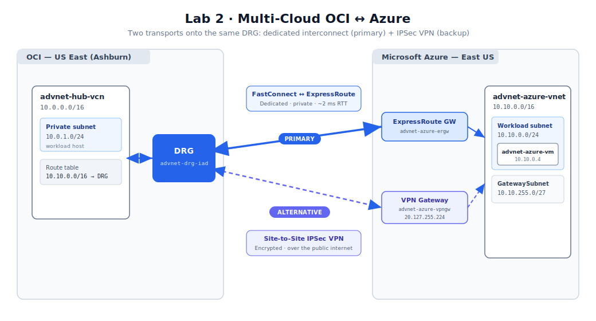
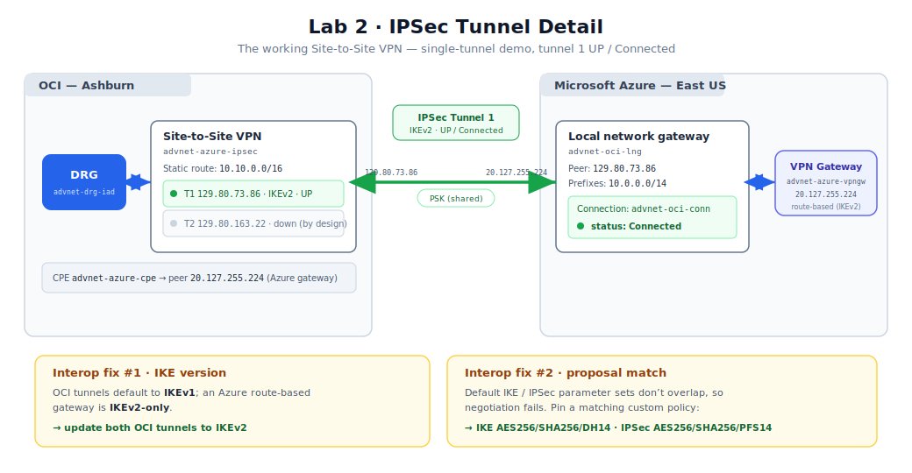

# Lab 2: Multi-Cloud — Connecting OCI to Microsoft Azure

## Introduction

In this lab you extend the OCI backbone from Lab 1 across a cloud boundary, connecting it privately to an application VNet in **Microsoft Azure East US**. You connect into the **Ashburn DRG** from Lab 1, so Azure becomes just another attachment on the hub — reachable, in principle, from every VCN in the topology.

There are two ways to join OCI and Azure, and this lab covers both:

* **Dedicated interconnect — FastConnect ⇄ ExpressRoute (the production path).** A private, dedicated Layer-2/3 circuit that bypasses the public internet entirely, with consistent low latency (~2 ms RTT) and predictable multi-gigabit throughput. This is the **headline architecture** and the path you provision live in a customer setting.
* **Site-to-Site IPSec VPN (the quick / backup path).** An encrypted tunnel over the public internet, stood up in minutes with no carrier provisioning. This lab **builds and tests the VPN** to give you working cross-cloud connectivity immediately, and it is the right choice for dev/test, low-bandwidth, or as a redundant backup to the interconnect.

Both terminate on the **same DRG**, so the routing and security configuration in Task 4 is identical regardless of which transport you choose.

*Estimated Time:* 50 minutes



### Objectives

In this lab, you will:

* Create an application VNet and VM in Azure East US
* Provision the **FastConnect ⇄ ExpressRoute** dedicated interconnect (production path)
* Build and verify a **Site-to-Site IPSec VPN** as a working alternative/backup
* Resolve the two classic OCI ⇄ Azure VPN interoperability issues
* Configure routing and security on both clouds so traffic flows end-to-end

### Prerequisites

This lab assumes you have:

* Completed **Lab 1** (the Ashburn DRG `advnet-drg-iad` exists and is Available)
* An **Azure subscription** with rights to create VNets, virtual network gateways, and — for the dedicated path — **ExpressRoute**
* OCI entitlement to create **FastConnect** virtual circuits (for the dedicated path)
* The OCI and Azure CLIs available (both are pre-installed in OCI Cloud Shell and Azure Cloud Shell respectively)

> **Cost callout:** the **Azure ExpressRoute circuit bills as soon as it is provisioned**, before any traffic flows — it is the single biggest cost in the workshop. The **Azure VPN gateway** (`VpnGw1AZ`, ~$0.19/hr) also bills hourly. Tear both down promptly after the demo (Lab 6).

> **Azure address plan:**
>
> | Resource | CIDR / value |
> |----------|--------------|
> | App VNet | `10.10.0.0/16` |
> | Workload subnet | `10.10.0.0/24` |
> | `GatewaySubnet` (required name) | `10.10.255.0/27` |
> | App VM private IP | `10.10.0.4` |

## Task 1: Create the Azure application VNet and VM

These steps use the **Azure Portal**; equivalent Azure CLI is shown in collapsible blocks.

1. In the Azure Portal, create a **Resource Group** named `advnet-workshop-rg` in **East US**.

2. Create a **Virtual Network**:

   * **Name:** `advnet-azure-vnet`
   * **Region:** East US
   * **IPv4 address space:** `10.10.0.0/16`
   * **Subnet 1:** `advnet-azure-workload` = `10.10.0.0/24`
   * **Subnet 2:** `GatewaySubnet` = `10.10.255.0/27` (the name **must** be exactly `GatewaySubnet` — the gateway in Task 2/3 requires it)

   

   <details><summary>Azure CLI equivalent</summary>

   ```
   az group create -n advnet-workshop-rg -l eastus
   az network vnet create -g advnet-workshop-rg -n advnet-azure-vnet \
     --address-prefixes 10.10.0.0/16 \
     --subnet-name advnet-azure-workload --subnet-prefixes 10.10.0.0/24
   az network vnet subnet create -g advnet-workshop-rg --vnet-name advnet-azure-vnet \
     -n GatewaySubnet --address-prefixes 10.10.255.0/27
   ```
   </details>

3. Create a **Virtual Machine** in the workload subnet:

   * **Name:** `advnet-azure-vm`
   * **Image:** Ubuntu Server 22.04 LTS
   * **Size:** `Standard_B1s`
   * **No public inbound ports**; **no public IP** (private IP only — it lands on `10.10.0.4`)
   * **Admin user:** `azureuser` with an SSH public key

4. On the VM's network security group (`advnet-azure-vmNSG`), add an inbound rule **`Allow-OCI-Lab`** permitting any protocol from source `10.0.0.0/14` (the OCI workshop supernet) so OCI hosts can reach the Azure VM.

   

## Task 2: Provision the FastConnect ⇄ ExpressRoute interconnect (production path)

This is the dedicated, private path. It is the architecture you headline in a customer demo and provision live.

1. **Azure — ExpressRoute gateway.** In `advnet-azure-vnet`, create a **Virtual Network Gateway**:

   * **Name:** `advnet-azure-ergw`
   * **Gateway type:** ExpressRoute
   * **SKU:** Standard (or ErGw1AZ)
   * **Virtual network:** `advnet-azure-vnet` (it uses the `GatewaySubnet`)

   This provisioning takes 20–45 minutes — start it and continue.

2. **Azure — ExpressRoute circuit.** Create an **ExpressRoute circuit**:

   * **Name:** `advnet-er-circuit`
   * **Provider:** **Oracle Cloud FastConnect**
   * **Peering location:** Washington DC
   * **SKU / Billing:** Standard / Metered (Local SKU where available)
   * **Bandwidth:** 1 Gbps

   When it provisions, open the circuit and copy its **Service Key** (a GUID). You hand this to OCI in the next step.

   

3. **OCI — FastConnect virtual circuit.** In the OCI Console (**Ashburn**), go to **Networking → FastConnect → Create FastConnect**:

   * **Connection type:** **FastConnect Partner**
   * **Partner:** **Microsoft Azure: ExpressRoute**
   * **Virtual circuit name:** `advnet-fc-azure`
   * **Dynamic Routing Gateway:** `advnet-drg-iad`
   * **Provisioned bandwidth:** 1 Gbps
   * **Service key:** paste the Azure ExpressRoute service key
   * **Customer BGP peering IP / Oracle BGP peering IP:** supply a non-overlapping `/30` (for example `192.168.10.0/30`); repeat with a second `/30` (`192.168.10.4/30`) for the redundant secondary session

   

4. **Confirm both ends provision.** The OCI FastConnect virtual circuit moves to **UP**; the Azure ExpressRoute circuit shows **Provider status: Provisioned** and the private peering becomes **Enabled**. Routing and security are then configured in **Task 4** (the interconnect terminates on the DRG, so the route/security steps are shared with the VPN path).

   > **Why the dedicated path is non-transitive by default:** the managed interconnect advertises VCN CIDRs, and the DRG will not, by default, forward traffic straight between two non-VCN attachments. Carrying on-premises traffic *through* OCI to Azure requires hairpinning through a VCN-resident firewall — the advanced pattern built in optional Lab 3b.

## Task 3: Build a Site-to-Site IPSec VPN (working alternative / backup)

The VPN gives you immediate, encrypted cross-cloud connectivity without waiting on circuit provisioning. You build the Azure side, the OCI side, then resolve two interoperability issues to bring the tunnel up.



### Task 3a: Azure VPN gateway

1. Create a **Virtual Network Gateway**:

   * **Name:** `advnet-azure-vpngw`
   * **Gateway type:** VPN
   * **VPN type:** **Route-based**
   * **SKU:** `VpnGw1AZ`
   * **Virtual network:** `advnet-azure-vnet`
   * **Public IP:** create `advnet-azure-vpngw-pip` (Standard, Static, zone-redundant)

   Provisioning takes ~20–30 minutes. When done, record the gateway's **public IP** (in this build: `20.127.255.224`).

   

   > **Critical:** an Azure **route-based** gateway is **IKEv2-only**. Remember this — it is the first interoperability gotcha in Task 3c.

### Task 3b: OCI CPE, IPSec connection, and tunnels

1. In the OCI Console (**Ashburn**), create a **Customer-Premises Equipment (CPE)** object representing the Azure gateway:

   * **Name:** `advnet-azure-cpe`
   * **IP address:** `20.127.255.224` (the Azure VPN gateway public IP)

2. Create a **Site-to-Site VPN (IPSec connection)**:

   * **Name:** `advnet-azure-ipsec`
   * **Customer-Premises Equipment:** `advnet-azure-cpe`
   * **Dynamic Routing Gateway:** `advnet-drg-iad`
   * **Routing type:** **Static**
   * **Static route CIDR:** `10.10.0.0/16` (the Azure VNet)

   OCI provisions **two tunnels**, each with its own Oracle public IP (in this build: `129.80.73.86` and `129.80.163.22`).

   

   <details><summary>OCI CLI equivalent (Cloud Shell)</summary>

   ```
   CPE=$(oci network cpe create -c $COMP --ip-address 20.127.255.224 \
     --display-name advnet-azure-cpe --query 'data.id' --raw-output)
   IPSEC=$(oci network ip-sec-connection create -c $COMP --cpe-id $CPE \
     --drg-id $DRG --static-routes '["10.10.0.0/16"]' \
     --display-name advnet-azure-ipsec --query 'data.id' --raw-output)
   # list the two tunnels:
   oci network ip-sec-tunnel list --ipsc-id $IPSEC --all \
     --query 'data[].{ip:"vpn-ip",status:status,ike:"ike-version"}' --output table
   ```
   </details>

3. Set a **shared secret (PSK)** on the tunnel(s). This build uses the demo value `AdvNetLab2DemoPSK2026` and brings up **tunnel 1** only (single-tunnel demo); configure both tunnels for production redundancy.

   <details><summary>OCI CLI — set PSK</summary>

   ```
   oci network ip-sec-psk update --ipsc-id $IPSEC --tunnel-id $T1 \
     --shared-secret AdvNetLab2DemoPSK2026 --force
   ```
   </details>

### Task 3c: Azure connection + the two interoperability fixes

1. On Azure, create a **Local Network Gateway** representing the OCI tunnel endpoint, then a **VPN connection**:

   * **Local network gateway** `advnet-oci-lng`: gateway IP `129.80.73.86` (OCI tunnel 1), address prefixes `10.0.0.0/14`
   * **VPN connection** `advnet-oci-conn`: `advnet-azure-vpngw` ↔ `advnet-oci-lng`, shared key `AdvNetLab2DemoPSK2026`

   <details><summary>Azure CLI equivalent</summary>

   ```
   az network local-gateway create -g advnet-workshop-rg -n advnet-oci-lng \
     --gateway-ip-address 129.80.73.86 --local-address-prefixes 10.0.0.0/14
   az network vpn-connection create -g advnet-workshop-rg -n advnet-oci-conn \
     --vnet-gateway1 advnet-azure-vpngw --local-gateway2 advnet-oci-lng \
     --shared-key AdvNetLab2DemoPSK2026
   ```

   > In newer Azure CLI builds the command group `local-network-gateway` was renamed to **`local-gateway`** (the parameters are unchanged). If `local-network-gateway` is "not recognized," use `local-gateway`.
   </details>

   At this point the connection will likely **not** come up. Two defaults must be reconciled:

2. **Gotcha #1 — IKE version.** OCI tunnels default to **IKEv1**, but the Azure route-based gateway is **IKEv2-only**. Update both OCI tunnels to IKEv2:

   ```
   oci network ip-sec-tunnel update --ipsc-id $IPSEC --tunnel-id $T1 \
     --ike-version V2 --force
   ```

3. **Gotcha #2 — proposal mismatch.** The two clouds' default IKE/IPSec parameter sets do not overlap, so phase-1/phase-2 negotiation fails. Pin a matching **custom policy** on the Azure connection (OCI accepts it as the responder):

   ```
   az network vpn-connection ipsec-policy add -g advnet-workshop-rg \
     --connection-name advnet-oci-conn \
     --ike-encryption AES256 --ike-integrity SHA256 --dh-group DHGroup14 \
     --ipsec-encryption AES256 --ipsec-integrity SHA256 --pfs-group PFS14 \
     --sa-lifetime 28800 --sa-max-size 102400000
   ```

   Within ~50 seconds the tunnel negotiates and comes up.

4. **Verify both ends agree:**

   ```
   # OCI side — tunnel 1 status:
   oci network ip-sec-tunnel list --ipsc-id $IPSEC --all \
     --query 'data[].{ip:"vpn-ip",ike:"ike-version",status:status}' --output table
   #  -> 129.80.73.86 | V2 | UP

   # Azure side — connection status:
   az network vpn-connection show -g advnet-workshop-rg -n advnet-oci-conn \
     --query connectionStatus -o tsv
   #  -> Connected
   ```

   

   > A freshly established tunnel shows **0 bytes** in/out until routing (Task 4) steers real traffic across it — this is expected, not a fault.

## Task 4: Configure routing and security on both clouds

This step is shared by both transports — the interconnect and the VPN both terminate on `advnet-drg-iad`, so OCI just needs to route the Azure CIDR to the DRG and permit the Azure source range.

1. **OCI route tables — add the Azure CIDR.** On each OCI VCN route table, add a rule sending `10.10.0.0/16` to the DRG:

   | Route table | Destination | Target |
   |-------------|-------------|--------|
   | Hub private | `10.10.0.0/16` | `advnet-drg-iad` |
   | Spoke-1 | `10.10.0.0/16` | `advnet-drg-iad` |
   | Remote-Spoke (Phoenix) | `10.10.0.0/16` | `advnet-drg-phx` |

   <details><summary>OCI CLI — safe append (does not overwrite existing rules)</summary>

   `route-table update` *replaces* the entire rule set, so fetch the current rules, append one, and write back. The convenience pattern used in this build deep-converts the CLI's kebab-case keys to camelCase, strips nulls, and appends:

   ```
   # /tmp/rt.jq:
   # def dc: walk(if type=="object" then with_entries(.key|=gsub("-(?<x>[a-z])";"\(.x|ascii_upcase)")) else . end);
   # [.[]|dc|with_entries(select(.value!=null))]
   #   + [{destination:$cidr,destinationType:"CIDR_BLOCK",networkEntityId:$ne}]

   oci network route-table get --rt-id $RT --query 'data."route-rules"' --raw-output > /tmp/rr.json
   jq -c --arg ne $DRG --arg cidr 10.10.0.0/16 -f /tmp/rt.jq /tmp/rr.json > /tmp/rr_new.json
   oci network route-table update --rt-id $RT --route-rules file:///tmp/rr_new.json --force
   ```
   </details>

2. **OCI security lists — permit the Azure source.** The workshop supernet `10.0.0.0/14` does **not** include Azure's `10.10.0.0/16`, so add an explicit stateful ingress rule on each OCI security list:

   * **Source CIDR:** `10.10.0.0/16`
   * **IP Protocol:** All Protocols

3. **Azure side.** A route-based gateway automatically makes the connected prefixes (`10.0.0.0/14`, from the local network gateway) reachable from the VNet — no user-defined route is required. Confirm the NSG rule `Allow-OCI-Lab` from Task 1 is present so the Azure VM accepts OCI-sourced traffic.

4. **Cross-region reach (Phoenix → Azure) — procedure.** The IPSec/FastConnect attachment lives on the **Ashburn** DRG, so a Phoenix host reaches Azure only if the Ashburn DRG's `10.10.0.0/16` route propagates across the RPC to the Phoenix DRG. Configure this with **DRG route distributions**:

   * On `advnet-drg-iad`, ensure the **RPC attachment's** export route distribution includes the IPSec/FastConnect-learned `10.10.0.0/16`.
   * On `advnet-drg-phx`, ensure the **remote-spoke VCN attachment's** import route distribution accepts routes learned from the RPC.

   With the route rule from step 1 already on the Remote-Spoke route table, Phoenix → Azure traffic then flows: Remote-Spoke → Phoenix DRG → RPC → Ashburn DRG → interconnect/VPN → Azure. (Validation is performed in Lab 5 with Network Path Analyzer.)

## Task 5: Reference — VPN vs. dedicated interconnect

**Site-to-Site VPN (IPSec over the public internet)**

* *Pros:* up in minutes; no carrier provisioning; low/no fixed cost; encrypted by default; ideal for dev/test, low bandwidth, or as a backup path.
* *Cons:* rides the public internet, so latency/throughput vary; per-tunnel bandwidth ceilings; degrades under congestion.

**Dedicated interconnect (FastConnect ⇄ ExpressRoute)**

* *Pros:* private, dedicated path off the public internet; consistent low latency (~2 ms RTT) and predictable 1/2/5/10 Gbps throughput; redundant circuit pair; right for production and high-volume multi-cloud apps.
* *Cons:* higher fixed cost (ExpressRoute bills on provisioning); slower to stand up (circuit + BGP); needs region/peering proximity; more moving parts (service keys, BGP /30s, two consoles).

**Rule of thumb:** VPN for quick, cheap, or backup connectivity and dev/test; dedicated interconnect for production and predictable performance. Many designs run **both** — interconnect primary, VPN backup — and because both land on the same DRG, failover is a routing concern, not a redesign.

## Lab Recap

You connected OCI to Azure two ways onto the same Ashburn DRG:

* An Azure VNet and VM in East US
* The **FastConnect ⇄ ExpressRoute** dedicated interconnect (production path)
* A working **Site-to-Site IPSec VPN**, with both classic interop issues resolved — **IKEv2** (Azure route-based is IKEv2-only) and a **matching custom IKE/IPSec policy** (default proposals don't overlap) — verified **UP / Connected**
* Routing and security on both clouds, plus the cross-region propagation procedure for Phoenix → Azure

## Learn More

* [Access to Microsoft Azure (FastConnect partner)](https://docs.oracle.com/en-us/iaas/Content/Network/Concepts/azure.htm)
* [Site-to-Site VPN overview](https://docs.oracle.com/en-us/iaas/Content/Network/Tasks/overviewIPsec.htm)
* [Supported IPSec parameters](https://docs.oracle.com/en-us/iaas/Content/Network/Reference/supportedIPsecparams.htm)
* [Configure IPsec/IKE policy for S2S VPN (Azure)](https://learn.microsoft.com/en-us/azure/vpn-gateway/vpn-gateway-ipsecikepolicy-rm-powershell)
* [DRG route distributions](https://docs.oracle.com/en-us/iaas/Content/Network/Tasks/managingDRGs.htm#drg_route_distribution)

## Acknowledgements

* **Author** — Eli Schilling, Technical Engagement Services, Oracle
* **Contributors** — Oracle LiveLabs Platform Team
* **Last Updated By/Date** — Eli Schilling, June 2026
