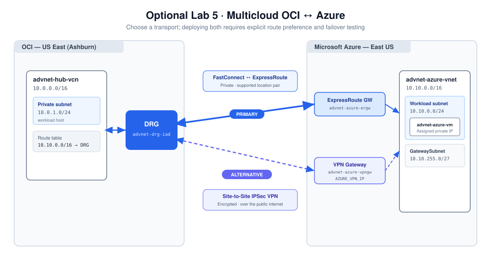
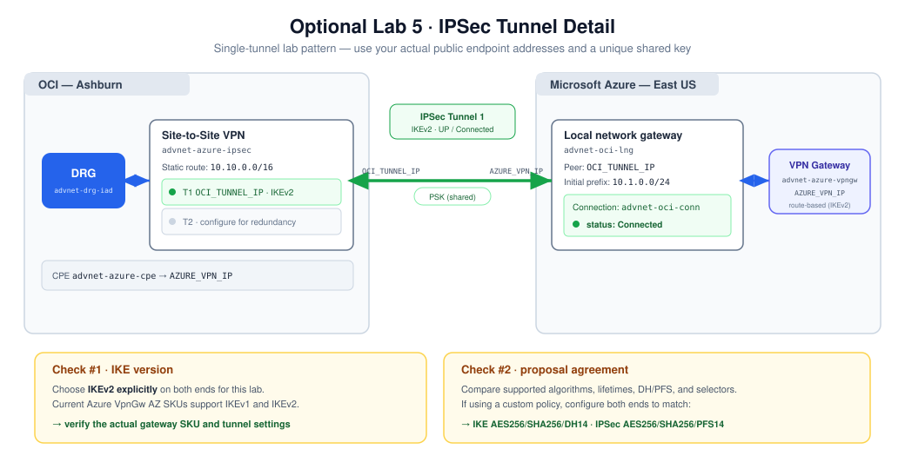

# Optional Lab 5: Multicloud — Connecting OCI to Microsoft Azure

## Introduction

Extend the OCI backbone to an application VNet in **Microsoft Azure East US**. The connection terminates on the **Ashburn DRG** from Lab 1. Private workload reachability then depends on subnet routes, the DRG's attachment tables, the selected transport, and security controls in both clouds.

Two transports address different customer needs:

* **FastConnect ↔ ExpressRoute:** a private interconnect for a supported OCI/Azure location pair. Plan its bandwidth, redundant connections, circuit ownership, and provisioning before the event.
* **Site-to-Site IPSec VPN:** encrypted connectivity over the public internet, useful for an initial connection, suitable workloads, or a deliberately designed backup path. Plan tunnel redundancy and matching IKE/IPSec parameters.

Both can attach to the DRG, but provisioning both does not automatically deliver failover. Route advertisements and preferences must select the intended path, including the return direction.

**Estimated time:** 90–120 minutes of hands-on work, plus gateway/circuit provisioning. Alternatively, use Tasks 1 and 6 as a **25-minute design discussion** with no new resources.



### Objectives

* Plan non-overlapping cloud networks and agree on transport ownership.
* Create an Azure application VNet and private VM.
* Connect an ExpressRoute circuit to OCI FastConnect and the VNet gateway.
* Configure OCI and Azure VPN endpoints with explicit IKEv2 and matching policies.
* Check learned prefixes and reciprocal routes rather than equating tunnel status with application success.
* Compare VPN, FastConnect, multicloud interconnect, and tested failover.

### Prerequisites and execution choices

* Complete Lab 1. Lab 2's Bastion access is the test source for this extension.
* An Azure subscription with permission to create a resource group, VNet, VM, NSG, gateways, and connections. The dedicated path also requires ExpressRoute and OCI FastConnect permissions.
* The OCI CLI in OCI Cloud Shell and Azure CLI in Azure Cloud Shell, if using the optional command examples. They are separate authenticated environments; variables do not transfer between them.
* Administrator approval for the billable resources and current quotas/SKUs. Verify supported region and peering-location combinations before choosing the interconnect path.

Choose **one transport** to implement initially: Task 3 for interconnect or Task 4 for VPN, followed by the shared routing and tests in Task 5. Implement the other transport only if it is included in the customer agenda. Reading both paths remains useful even when only one is deployed.

> **Cost:** Azure VPN/ExpressRoute gateways, VMs, and circuits incur charges. ExpressRoute billing begins when a service key is issued, even before the provider finishes provisioning. Check current pricing for the selected SKUs, bandwidth, and billing plan. Track both clouds' resources for Cleanup.

## Task 1: Plan the cloud boundary and transport

1. Reserve the Azure ranges below. Do not reuse an OCI prefix:

   | Resource | Address plan |
   | --- | --- |
   | `advnet-azure-vnet` | `10.10.0.0/16` |
   | `advnet-azure-workload` subnet | `10.10.0.0/24` |
   | `GatewaySubnet` | `10.10.255.0/27` |
   | Azure VM | Record the assigned private IP; do not assume `10.10.0.4` |
   | OCI private workloads | Hub `10.0.1.0/24`, Spoke-1 `10.1.0.0/24`, Remote-Spoke `10.2.0.0/24` |

2. Decide which prefixes and service ports may cross the boundary. The examples validate TCP **8080** between Spoke-1 and the Azure test host. Keep gateway-management ranges separate from workload access.
3. For the dedicated path, verify **Ashburn / Washington DC or Washington DC2** support and choose the pairing available to your subscription. Oracle Interconnect for Azure requires the connected VCN and VNet to belong to the same company. Review the [current interconnect scope and locations](https://docs.oracle.com/en-us/iaas/Content/multicloud/interconnect-azure.htm).
4. Record owners for circuits, DNS, firewall policy, monitoring, and incident response. Agree on the primary and backup paths, if both are planned.
5. For a production VPN design, plan two OCI tunnels, redundant peer connectivity, BGP where appropriate, permitted advertisements, and failover tests. This exercise starts with a single tunnel and static prefixes to keep negotiation and routing observable.

## Task 2: Create the Azure application VNet and VM

1. In the **Azure Portal**, create resource group **`advnet-workshop-rg`** in **East US**. Add ownership tags and record the subscription/resource-group scope.
2. Create VNet **`advnet-azure-vnet`**, address space **`10.10.0.0/16`**, with workload subnet **`10.10.0.0/24`** and subnet named exactly **`GatewaySubnet`**, **`10.10.255.0/27`**.

   <details><summary>Azure CLI equivalent — Azure Cloud Shell</summary>

   ```bash
   az group create -n advnet-workshop-rg -l eastus
   az network vnet create -g advnet-workshop-rg -n advnet-azure-vnet \
     --address-prefixes 10.10.0.0/16 \
     --subnet-name advnet-azure-workload --subnet-prefixes 10.10.0.0/24
   az network vnet subnet create -g advnet-workshop-rg \
     --vnet-name advnet-azure-vnet -n GatewaySubnet \
     --address-prefixes 10.10.255.0/27
   ```

   </details>

3. Create private VM **`advnet-azure-vm`** in the workload subnet, using Ubuntu LTS and a small approved available size. Use an SSH public key and administrator `azureuser`. Assign **no public IP** and **no public inbound management ports**.
4. Save [Azure cloud-init.yaml](../assets/azure-app/cloud-init.yaml) and supply its contents as **custom data** in the VM's advanced settings. It creates a simple HTML endpoint and systemd service on TCP 8080, independent of OCI instance metadata. Use an Ubuntu platform image with Python 3 installed; the bootstrap does not download packages. If your chosen image lacks Python 3, arrange approved package access and install it before running the service.

5. Add an Azure NSG inbound allow rule for **TCP 8080 from `10.1.0.0/24`**. Add Hub or Remote-Spoke source prefixes only if testing those paths. Check both subnet and NIC NSG associations and their priorities.
6. Record the actual VM private IP. Use **Azure VM Run Command** to verify `command -v python3`, `systemctl status advnet-web`, and `curl http://127.0.0.1:8080/` without exposing SSH. Resolve bootstrap before transport troubleshooting.

**Expected result:** a private Azure application endpoint and a known source/port security policy. Transport provisioning follows; a local web response does not yet prove cross-cloud reachability.

## Task 3: Dedicated path — FastConnect ↔ ExpressRoute

1. Create an **ExpressRoute Virtual Network Gateway** named `advnet-azure-ergw` in `advnet-azure-vnet`. Select an approved currently supported gateway SKU and the VNet's `GatewaySubnet`. Wait for successful deployment; gateways can take tens of minutes.
2. Create ExpressRoute circuit **`advnet-er-circuit`** with provider **Oracle Cloud FastConnect**, the selected supported Washington DC peering location, approved bandwidth, and appropriate circuit SKU/billing plan. For the lab, choose a single location's available resiliency option; discuss broader production resiliency separately.
3. Record its **service key** and provider/circuit state. Store the key in your private worksheet, not a shared screenshot or public guide. See [ExpressRoute circuit creation and billing](https://learn.microsoft.com/en-us/azure/expressroute/expressroute-howto-circuit-portal-resource-manager).
4. In OCI **Ashburn**, open **Networking → FastConnect → Create FastConnect**. Choose the partner option **Microsoft Azure: ExpressRoute**, a **private virtual circuit**, name **`advnet-fc-azure`**, and DRG **`advnet-drg-iad`**. Supply the service key and matching bandwidth.
5. Reserve two non-overlapping BGP peering blocks. If the selected connection form asks for endpoint addresses, an example is:

   | Session | Block | Oracle endpoint | Customer/Azure endpoint |
   | --- | --- | --- | --- |
   | Primary | `192.168.10.0/30` | `192.168.10.1/30` | `192.168.10.2/30` |
   | Secondary | `192.168.10.4/30` | `192.168.10.5/30` | `192.168.10.6/30` |

   Verify these blocks do not overlap other networks. Follow the current partner form and documented address ownership; do not put a subnet's network address into an endpoint field.

6. Wait for OCI circuit **UP** and Azure provider status **Provisioned**, circuit **Enabled**, and private peering established. Record circuit IDs and peer status.
7. **Link the VNet gateway to the ExpressRoute circuit:** create an Azure connection of type **ExpressRoute**, name `advnet-azure-er-connection`, selecting `advnet-azure-ergw` and `advnet-er-circuit`. This association is required; a provisioned circuit without a VNet connection does not reach the application subnet.
8. Inspect the Azure gateway/VM effective routes and OCI DRG route tables for the allowed prefixes. Continue with Task 5.

**Boundary:** the managed interconnect is a VCN–VNet service. Do not assume it supports on-premises transit through one cloud to the other, or that placing a firewall in a VCN changes that supported scope. Review the current provider constraints during architecture design.

## Task 4: VPN path — OCI Site-to-Site VPN and Azure VPN Gateway



### Create the Azure gateway

1. Create route-based **VPN Virtual Network Gateway** **`advnet-azure-vpngw`**, using an approved available SKU such as `VpnGw1AZ`, in `advnet-azure-vnet`. Use a **Standard static public IP** named `advnet-azure-vpngw-pip`, with zone options supported by the chosen SKU/region.
2. Wait for deployment and record the **actual gateway public IP**. If both VPN and ExpressRoute gateways are being deployed in one VNet, confirm supported coexistence SKUs and sufficient GatewaySubnet size before proceeding.
3. Select **IKEv2 explicitly** for this lab's connections. Current Azure route-based VpnGw AZ SKUs support IKEv1 and IKEv2; do not infer an IKEv2-only limitation from the route-based setting. See [Azure VPN gateway settings](https://learn.microsoft.com/en-us/azure/vpn-gateway/vpn-gateway-about-vpn-gateway-settings).

### Create OCI CPE and IPSec connection

4. In OCI **Ashburn**, create CPE **`advnet-azure-cpe`**, using the Azure gateway public IP from your worksheet.
5. Create Site-to-Site VPN **`advnet-azure-ipsec`**, select that CPE and `advnet-drg-iad`, and use **static routing** with Azure prefix **`10.10.0.0/16`** for this exercise.
6. OCI creates two tunnels. Record both tunnel OCIDs and Oracle VPN endpoint public IPs. Choose **tunnel 1** for the initial test. Set it to **IKEv2** and record its crypto parameters. A second unconfigured tunnel remains down; label that as a lab limitation, not a production success condition.
7. Generate a unique, sufficiently strong **pre-shared key** and set it for tunnel 1. Use the same key on the matching Azure connection. Do not reuse a published demo key or place the key in screenshots or shared notes.

   <details><summary>OCI CLI example — OCI Cloud Shell</summary>

   Replace the three values, then run in a Bash Cloud Shell. `REGION` keeps the regional operations explicit. If you already created these resources in the console, use their recorded IDs instead of creating duplicates.

   ```bash
   REGION=us-ashburn-1
   COMP='<working-compartment-ocid>'
   DRG='<ashburn-drg-ocid>'
   AZURE_VPN_IP='<actual-azure-gateway-public-ip>'
   CPE=$(oci network cpe create --region "$REGION" -c "$COMP" \
     --ip-address "$AZURE_VPN_IP" --display-name advnet-azure-cpe \
     --query 'data.id' --raw-output)
   IPSEC=$(oci network ip-sec-connection create --region "$REGION" -c "$COMP" \
     --cpe-id "$CPE" --drg-id "$DRG" --static-routes '["10.10.0.0/16"]' \
     --display-name advnet-azure-ipsec --query 'data.id' --raw-output)
   oci network ip-sec-tunnel list --region "$REGION" --ipsc-id "$IPSEC" --all \
     --query 'data[].{id:id,ip:"vpn-ip",status:status,ike:"ike-version"}' --output table
   T1='<recorded-tunnel-1-ocid>'
   oci network ip-sec-tunnel update --region "$REGION" --ipsc-id "$IPSEC" \
     --tunnel-id "$T1" --ike-version V2 --force
   read -r -s -p 'Unique VPN shared key: ' VPN_PSK
   oci network ip-sec-psk update --region "$REGION" --ipsc-id "$IPSEC" \
     --tunnel-id "$T1" --shared-secret "$VPN_PSK" --force >/dev/null
   unset VPN_PSK
   ```

   </details>

### Create the matching Azure connection

8. In Azure, create **Local Network Gateway** **`advnet-oci-lng`**. Its gateway IP is the **actual OCI tunnel-1 public IP**; its address prefixes are the allowed OCI workload ranges, initially **`10.1.0.0/24`**. Add Hub/Remote-Spoke prefixes only if they are part of your test scope.
9. Create VPN connection **`advnet-oci-conn`**, type **Site-to-site (IPSec)**, between `advnet-azure-vpngw` and `advnet-oci-lng`, with the same shared key and **IKEv2**.
10. Compare phase-1/phase-2 algorithms, DH/PFS groups, lifetimes, and selectors on both ends. If using a custom Azure policy, configure a **matching supported policy on OCI**. Do not assume the defaults must fail or that changing only one end makes them compatible.

   <details><summary>Azure CLI example — Azure Cloud Shell</summary>

   Enter the same shared key interactively in this separate shell. The example proposal must also be selected on the OCI tunnel and verified against both providers' supported parameters.

   ```bash
   OCI_TUNNEL_IP='<actual-oci-tunnel-1-public-ip>'
   az network local-gateway create -g advnet-workshop-rg -n advnet-oci-lng \
     --gateway-ip-address "$OCI_TUNNEL_IP" --local-address-prefixes 10.1.0.0/24
   read -r -s -p 'Same VPN shared key: ' VPN_PSK
   az network vpn-connection create -g advnet-workshop-rg -n advnet-oci-conn \
     --vnet-gateway1 advnet-azure-vpngw --local-gateway2 advnet-oci-lng \
     --connection-type IPsec --connection-protocol IKEv2 --shared-key "$VPN_PSK" \
     --output none
   unset VPN_PSK
   az network vpn-connection ipsec-policy add -g advnet-workshop-rg \
     --connection-name advnet-oci-conn \
     --ike-encryption AES256 --ike-integrity SHA256 --dh-group DHGroup14 \
     --ipsec-encryption AES256 --ipsec-integrity SHA256 --pfs-group PFS14 \
     --sa-lifetime 28800 --sa-max-size 102400000 --output none
   ```

   </details>

11. Verify OCI tunnel **UP** and Azure connection **Connected**. If negotiation fails, check endpoint IPs, shared-key agreement, IKE version, supported proposals, and diagnostics on both ends.

   ```bash
   # OCI Cloud Shell, with the OCI variables set above:
   oci network ip-sec-tunnel list --region "$REGION" --ipsc-id "$IPSEC" --all \
     --query 'data[].{ip:"vpn-ip",ike:"ike-version",status:status}' --output table
   # Azure Cloud Shell:
   az network vpn-connection show -g advnet-workshop-rg -n advnet-oci-conn \
     --query connectionStatus -o tsv
   ```

**Expected result:** transport up at both ends. Zero bytes before workload tests can be normal. A connected tunnel still needs the routes, policy, and running application in Task 5.

## Task 5: Configure routes, verify traffic, and plan redundancy

1. Add **`10.10.0.0/16 → advnet-drg-iad`** to the **Spoke-1 private subnet route table**. Preserve its existing local/remote routes, NAT default, and service route. Add the same Azure destination on the Hub private table only if testing Hub.
2. Inspect the **DRG route table associated with the source VCN attachment**. It must contain the Azure destination with the intended **IPSec tunnel or FastConnect attachment** as next hop. Inspect the external attachment's associated table for the permitted OCI return prefixes via their VCN attachments. Review route distributions when a learned route is absent.
3. On the Azure VM's NIC, inspect **effective routes** and ensure the allowed OCI prefix selects the gateway. For a static VPN, the Local Network Gateway prefixes must match the OCI sources. For ExpressRoute, inspect advertised/learned prefixes and the VNet's gateway connection. Confirm gateway route propagation is not disabled by an associated route table.
4. Verify the Azure NSG TCP 8080 allow rule from Spoke-1, its host web service, and the outbound OCI rules. If testing Azure-initiated traffic, add an explicit OCI application-NSG TCP 8080 rule from the approved Azure workload prefix. Stateful responses to an OCI-initiated request do not require opening every inbound port.
5. On Spoke-1 through Bastion, replace the placeholder and test:

   ```bash
   AZURE_APP_IP='<actual-azure-vm-private-ip>'
   curl --fail --connect-timeout 5 --max-time 15 "http://$AZURE_APP_IP:8080/"
   ```

   **Expected:** the page identifies `advnet-azure-vm` and **Microsoft Azure — East US**. Record the responding endpoint, transport, timestamp, and counters/log evidence. A successful request proves more than circuit/tunnel status.

6. **Optional Phoenix → Azure extension:** add the Azure route to the Remote-Spoke subnet's table with target `advnet-drg-phx`. Inspect Ashburn's RPC-facing DRG route table for the Azure route and the Phoenix VCN-facing table for the corresponding RPC-learned route. Also confirm Azure advertises/accepts the Remote-Spoke source prefix and the reverse path exists through Ashburn. A source VCN route alone is insufficient. Test from a Remote-Spoke shell reached by a Bastion in that VCN. NPA cannot prove a complete cross-region RPC path.
7. If a second VPN tunnel is included, create the second matching Azure Local Network Gateway/connection with the second OCI endpoint and its own matching secret/policy. Validate each tunnel independently. Review active-active/standby and BGP design with the facilitator rather than treating two tunnel objects as proof of high availability.
8. If both transports are implemented, record the selected route before a controlled test. With the facilitator, withdraw/disable only the lab's primary path, run a new application request, observe the backup route and recovery time, then restore the primary. Verify **both directions**; leave the topology in a known-good state.

## Task 6: Design review — VPN, FastConnect, and multicloud

This section incorporates the connectivity-theory material from the tenancy workshop and can be completed without provisioning.

| Topic | Site-to-Site VPN | FastConnect / private interconnect |
| --- | --- | --- |
| Transport | Encrypted tunnel over the public internet | Private provider/partner or colocated connection |
| Typical fit | Initial deployment, branches, appropriate workloads, backup | Predictable connectivity and sustained private traffic |
| Performance | Depends on internet path, gateway sizing, and tunnel limits | Depends on location, contracted bandwidth, circuit and application design |
| Redundancy | Two tunnels, redundant peers, route preferences | Redundant paths/locations, BGP sessions, provider ownership |
| Security design | Encryption plus prefix, port, DNS, and inspection policy | Private connectivity plus explicit policy; assess encryption requirements separately |
| Validation | Tunnel state, routes, counters, application tests | Circuit/BGP state, advertisements, routes, application tests |

Discuss these customer decisions:

1. Which prefixes may cross the boundary, and which must never be advertised?
2. Who owns DNS resolution, identity, security inspection, egress, and observability in each cloud?
3. What is the primary path, the backup path, and the measured recovery objective?
4. Are the proposed region/partner pairings and traffic types supported? What changes if a cloud provider lacks a direct interconnect in the needed location?
5. How will circuit, gateway, processing, data-transfer, and log costs be tracked? Who can deprovision each side?

For other cloud providers, use the same requirements-led approach: direct supported interconnect, provider-mediated connectivity, or public-endpoint VPN as appropriate. Verify current regional availability and provider constraints rather than assuming the Azure procedure applies unchanged.

## Lab Recap and checkpoint

Save the two clouds' resource inventory, address contract, selected transport, circuit/tunnel state, learned routes, security policy, and successful private HTTP response. Record any intentionally unconfigured tunnel and any untested failover claim. The discussion-only path produces an agreed architecture and test plan rather than a live connection.

Continue to the optional firewall workshop or **Cleanup**. Remove resources in both clouds; deleting only the OCI connection leaves Azure billable gateways/circuits behind.

## Learn More

* [Oracle Interconnect for Azure](https://docs.oracle.com/en-us/iaas/Content/multicloud/interconnect-azure.htm)
* [OCI Site-to-Site VPN](https://docs.oracle.com/en-us/iaas/Content/Network/Tasks/overviewIPsec.htm)
* [OCI supported IPSec parameters](https://docs.oracle.com/en-us/iaas/Content/Network/Reference/supportedIPsecparams.htm)
* [Azure VPN Gateway configuration settings](https://learn.microsoft.com/en-us/azure/vpn-gateway/vpn-gateway-about-vpn-gateway-settings)
* [Azure custom IPsec/IKE policies](https://learn.microsoft.com/en-us/azure/vpn-gateway/vpn-gateway-ipsecikepolicy-rm-powershell)
* [ExpressRoute circuits](https://learn.microsoft.com/en-us/azure/expressroute/expressroute-howto-circuit-portal-resource-manager)
* [DRG routing](https://docs.oracle.com/en-us/iaas/Content/Network/Tasks/managingDRGs.htm)

## Acknowledgements

* **Author** — Eli Schilling, Technical Engagement Services, Oracle
* **Contributors** — Oracle LiveLabs Platform Team
* **Last Updated By/Date** — Eli Schilling, October 2026
